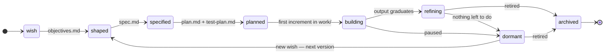

# Initiatives — a vision

**Status: draft for discussion. Nothing in this document is implemented.**

This describes a proposed third top-level concept for this repo, alongside `decks/`
and `demos/`. It is written to be read and argued with, not followed.

---

## 1. Why

`decks/` and `demos/` hold *outputs*. Nothing in the repo holds the *work that
produces them* or the *intent behind them*. Today a body of thinking — why a deck
exists, what it still needs, what the next step is — lives in chat sessions, in the
user's head, and in scattered prompt histories. It evaporates between sessions.

An initiative is the missing container for that. It makes intent durable, gives
half-formed ideas a legitimate place to sit before they are good enough to publish,
and — critically — gives an automated agent something to read so it can answer the
question "what should be done next?" without a human framing it every time.

## 2. What an initiative is

> **An initiative is a durable unit of intent, together with the work that pursues
> it and the capability it develops along the way.**

An initiative is not a project. A project ends. An initiative goes **dormant** and
can be revisited — a year later, to produce the next version of the thing, using the
tooling it built the first time.

An initiative holds three kinds of thing:

| | What it is | Lifetime |
|---|---|---|
| **Intent** | The wish, objectives, spec, plan, test plan — the elaboration chain | Grows monotonically; never deleted |
| **Capability** | Skills, scripts, prompts, code libraries the initiative develops | Outlives any single output; reused on revisit |
| **Outputs** | Pointers to what it actually produced | Graduates out of the initiative |

### 2.1 What an initiative can produce

- **One or more decks** of content in `decks/`.
- **A demo** — code that runs as a published example in `demos/`.
- **Code that executes elsewhere** — AWS, a ChatGPT GPT/site, or any environment
  outside this repo. The initiative holds the source and a pointer to where it runs.
- **Capability applied to existing content** — a skill, script, or library that gets
  embedded into a demo, or that *operates upon* decks (e.g. an auditor that checks
  every deck's map markers, or a generator that rebuilds a section).

That last one matters: **an initiative can produce no published artifact at all.**
Its output is capability. Those are still initiatives and still belong here.

## 3. Relationship to decks and demos

**Born inside, graduate out, capability stays.**

```
initiatives/night-sky/            decks/ , demos/                external
  wish.md                                                        (AWS, GPTs)
  spec.md
  work/            ──graduates──▶ demos/SBDC Night Sky/  ──┐
  lib/star-chart/  ──embedded in──────────▲                │
  skills/                                 │                │
  initiative.json  ────pointer to─────────┴────────────────┴──▶ recorded in outputs[]
```

1. Work-in-progress output is built under `initiatives/<name>/work/`. It is not
   published as a deck or demo, and not subject to deck/demo conventions, while it
   lives there.
2. When it is good enough, it **graduates** — moves to `decks/<name>/` or
   `demos/<name>/`, and from then on follows the normal conventions in `AGENTS.md`.
   The initiative keeps a pointer in `outputs[]`, not a copy.
3. **Capability does not graduate with it.** `lib/`, `skills/`, and `prompts/` stay
   in the initiative, because that is what makes the initiative revisitable. When the
   initiative wakes up to produce version 2, the tooling is right there.
4. If a library becomes broadly useful to *other* initiatives or decks, it graduates
   a second time — into `shared/`, under the existing opt-in-library convention.

| Output kind | Lives during development | Graduates to | Pointer recorded as |
|---|---|---|---|
| Deck content | `work/` | `decks/<name>/` | `{"kind":"deck","path":"decks/<name>"}` |
| Demo | `work/` | `demos/<name>/` | `{"kind":"demo","path":"demos/<name>"}` |
| External code | `work/` or `src/` | stays in initiative; deployed out | `{"kind":"external","url":"..."}` |
| Shared library | `lib/` | `shared/<lib>/` when widely used | `{"kind":"capability","path":"shared/<lib>"}` |
| Skill / prompt | `skills/`, `prompts/` | stays in the initiative | `{"kind":"capability","path":"initiatives/<n>/skills/x"}` |

Nothing about existing decks or demos changes, and no migration is required.

## 4. Folder layout

```
initiatives/
  index.html           # generated — the Initiative TOC (§8.1)
  sweep.json           # sweep job configuration (§7.3)
  <initiative-name>/
    initiative.json    # required — the machine-readable state
    index.html         # required — the initiative's overview page (§8.2)
    wish.md            # required — the original vague goal, in the user's words
    overview.md        # optional — hand-written prose, appended to index.html (§8.2)
    objectives.md      # what "done" would mean, once it can be said
    spec.md            # what it is
    plan.md            # how it gets built, in steps
    test-plan.md       # how we know it works
    log.md             # append-only record of what happened and when
    prompts/           # reusable prompts for ongoing work on this initiative
    notes/             # research, references, dead ends
    work/              # in-progress output, pre-graduation
    lib/               # code libraries this initiative develops
    skills/            # skills this initiative develops
```

**Only `initiative.json`, `index.html`, and `wish.md` exist at birth.** Every other
document appears as the lifecycle advances. This is deliberate: **the absence of a
document is itself the signal for the next step.** An initiative with a wish and no
objectives has an obvious next action, and the sweep job (§7) can see it without being
told.

### 4.1 `wish.md` is verbatim and permanent

`wish.md` holds the user's original words, unedited, forever. Elaboration happens in
`objectives.md` and later documents — never by revising the wish. Months of drift are
exactly when the original *why* becomes most valuable and least recoverable.

A revisit that produces version 2 **appends** a new dated wish to the same file rather
than replacing the first one. The file becomes a chronological record of what was
wanted and when.

## 5. Lifecycle



| Stage | What exists | What advances it | Typical next step |
|---|---|---|---|
| `wish` | `wish.md` — a vague goal, possibly one sentence | Turning desire into stated outcomes | Draft `objectives.md` |
| `shaped` | + `objectives.md` | Deciding what the thing actually *is* | Draft `spec.md` |
| `specified` | + `spec.md` | Breaking it into ordered work | Draft `plan.md` and `test-plan.md` |
| `planned` | + `plan.md` | Doing the first step | Build the first increment in `work/` |
| `building` | `work/` has real content | Reaching publishable quality | Next plan step, or graduate |
| `refining` | Output has graduated | Feedback, polish, follow-on versions | Work the todo list |
| `dormant` | Nothing actionable, by choice | A new wish, or an external trigger | Nothing — this is a resting state |
| `archived` | Explicitly retired | — | Nothing, ever |

Two rules make the lifecycle useful rather than decorative:

- **Stages are declared in `initiative.json` and cross-checked against files present.**
  A validator flags `"stage": "specified"` with no `spec.md`.
- **Any stage can regress.** The diagram shows the common paths, but a `specified`
  initiative whose spec reveals the objectives were wrong should go back to `shaped`.
  Regression is normal and is not failure. The one exception is `archived`, which is
  terminal.

## 6. `initiative.json`

Mirrors the existing `deck.json` convention — small, optional-where-possible, one file
per directory. Humans read the markdown; the job reads this.

```json
{
  "title": "Migration Atlas",
  "summary": "Interactive map of historical human migration, as a demo and a reusable map library.",
  "stage": "refining",
  "value": "high",
  "updated": "2026-08-12",
  "staleness_days": 21,
  "outputs": [
    { "kind": "demo",       "path": "demos/migration_map",     "status": "published" },
    { "kind": "capability", "path": "initiatives/migration-atlas/lib/basemap", "status": "internal" }
  ],
  "todo": [
    {
      "id": "add-1500-1800-layer",
      "title": "Add the 1500-1800 migration layer",
      "state": "actionable",
      "value": "high",
      "effort": "medium",
      "advances_stage": false
    },
    {
      "id": "test-plan",
      "title": "Write test-plan.md covering layer toggling and basemap fallback",
      "state": "actionable",
      "value": "medium",
      "effort": "small",
      "advances_stage": true
    },
    {
      "id": "source-african-data",
      "title": "Source pre-colonial African migration dataset",
      "state": "blocked",
      "blocked_by": "legal:redistribution rights for the Cambridge dataset",
      "value": "high"
    }
  ]
}
```

### 6.1 Field notes

- `stage` — one of the §5 values.
- `value` — `high` / `medium` / `low`. The initiative's own worth, used to rank across
  initiatives.
- `staleness_days` — optional per-initiative override of the global flag threshold
  (§7.3). A slow-burn initiative can set `90` and stop nagging; a hot one can set `3`.
- `todo[].state` — `actionable` or `blocked`. Completed items are removed and recorded
  in `log.md`, so the file stays short and always reads as "what's left".
- `todo[].blocked_by` — **required when blocked**, and namespaced — see §6.2.
- `todo[].advances_stage` — true when doing this item moves the initiative to the next
  lifecycle stage. These get a ranking boost, because a stalled lifecycle is the
  specific failure this system exists to prevent.
- `todo[].effort` — `small` / `medium` / `large`.

### 6.2 Why an item is blocked

"Waiting on a human" is only one reason, and treating it as the only one loses
information the job could act on. The blocker is namespaced so its *kind* is machine-legible:

| Prefix | Means | Example | How it clears |
|---|---|---|---|
| `todo:<id>` | **Precedent action** — an earlier item in this initiative must land first | `todo:build-basemap` | **Auto** |
| `initiative:<name>` | Cross-initiative dependency — another initiative must reach a stage | `initiative:map-library` | **Auto** |
| `review:<pr>` | Work is done, PR open, awaiting review | `review:#204` | **Auto** |
| `schedule:<date>` | Time-gated — cannot act before a date | `schedule:2026-11-01` | **Auto** |
| `human:<question>` | A decision only the user can make — taste, scope, priority | `human:which basemap style?` | Human |
| `permission:<what>` | Credentials, API key, OAuth grant, account, repo scope | `permission:AWS deploy role` | Human |
| `cost:<what>` | Needs spending approval or a paid tier | `cost:$40/mo tile service` | Human |
| `legal:<what>` | Licensing or rights clearance | `legal:dataset redistribution` | Human |
| `data:<what>` | A required input does not exist yet | `data:1500-1800 migration set` | Mixed |
| `external:<thing>` | A third party must act | `external:vendor API reaches GA` | External event |
| `upstream:<dep>` | Needs a version or feature of a dependency | `upstream:leaflet 2.0` | External event |

The three **clearance classes** are what make this worth the taxonomy:

- **Auto** — the sweep can verify the condition itself and flip the item to
  `actionable` with no human involvement. A `schedule:` date passes; a `review:` PR
  merges; a precedent `todo:` disappears. These should never sit blocked by accident.
- **Human** — only these belong in the escalation list (§8.4). Keeping them separate
  from the auto class is what keeps that list short enough to read.
- **External event** — nobody in this repo can clear it. The sweep re-checks
  cheaply where it can and otherwise leaves it alone; these should *not* count against
  an initiative's staleness, because waiting is the correct behaviour.

### 6.3 How todo items get removed

**Not by a GitHub Action after merge.** The PR that does the work also removes the
item and appends a line to `log.md`. Merging the PR is what enacts the removal.

This keeps the earlier guardrail intact while making it mechanically simple: the agent
*proposes* the closure, and the human merge *enacts* it. Concretely:

1. The sweep does the work, deletes the item from `todo[]`, appends to `log.md`,
   updates `updated`, and opens the PR.
2. In the same PR, any item whose `blocked_by` was `todo:<the removed id>` flips to
   `actionable` — a local, mechanical edit inside the same file.
3. If the PR is closed unmerged, nothing happened. State never diverged from reality,
   because the state change and the work were always the same commit.

Why not a merge-time Action:

- It needs write access to `main` and pushes a commit *after* every merge, which
  races with other merges and creates exactly the conflict class §7.4 exists to avoid.
- It needs the PR to declare which items it completed — a second source of truth
  (a trailer, a label) that can disagree with the diff.
- It breaks the "atomic" property: between merge and Action, the repo asserts that
  finished work is still pending.

The one place merge-time automation may still earn its place is **conflict
resolution** — rebasing or re-running the build for stale open sweep PRs. That is
mechanical and does not touch initiative state.

**Drift is caught by the validator, not by a bot.** If a human does work by hand and
forgets to remove the item, the next sweep sees it and can propose the cleanup. And
because a `blocked_by: todo:<id>` pointing at a nonexistent item is a build failure
(§9), a forgotten unblock cannot stay hidden — the build tells you.

## 7. The sweep job

A scheduled agent runs **twice daily** across all initiatives. Two phases, in order.

### 7.1 Phase 1 — Survey (always)

Read every `initiative.json`, derive state, and produce a **digest**:

- every initiative, its stage, and days since last activity
- its single top-ranked actionable item
- **every human-class blocker (§6.2), gathered into one list** — the most valuable
  part of the digest, because it is the only thing the job genuinely cannot resolve
- auto-class blockers whose condition is now satisfied, flipped to actionable
- initiatives past their staleness threshold but not marked dormant
- initiatives with zero actionable items that are not marked dormant — a defect

### 7.2 Phase 2 — Do work (each run)

Take the **top-ranked actionable items across all initiatives**, up to a configured
budget, do the work, and open PRs. Never self-merged.

Ranking, roughly:

```
score = value(initiative) × value(item) ÷ effort(item)
        + stage_gate_bonus     (item advances the lifecycle)
        + staleness_bonus      (initiative untouched for a long time)
```

The stage-gate and staleness bonuses exist to keep the job from grinding on one active
initiative's easy wins while three others sit at `wish` forever.

### 7.3 The work budget

How much a sweep may do is configured **in the repo**, not baked into the job or passed
at the call site — so changing throughput is a reviewable commit, and the job's
behaviour is readable from the repo alone.

`initiatives/sweep.json`:

```json
{
  "items_per_run": 1,
  "max_items_per_initiative": 1,
  "max_effort": "medium",
  "staleness_days": 10,
  "pr_strategy": "one-per-initiative",
  "protected_paths": ["shared/", "scripts/", ".github/"]
}
```

| Field | Default | Meaning |
|---|---|---|
| `items_per_run` | `1` | Total actionable items a single sweep may complete |
| `max_items_per_initiative` | `1` | Cap per initiative, so one hot initiative can't eat the whole budget |
| `max_effort` | `medium` | Largest item the job may attempt unsupervised; `large` items escalate to the digest |
| `staleness_days` | `10` | Days without activity before an initiative is flagged; overridable per initiative (§6.1) |
| `pr_strategy` | `one-per-initiative` | How completed items are packaged (§7.4) |
| `protected_paths` | `shared/`, `scripts/`, `.github/` | Paths a sweep PR may never touch unattended (§7.4) |

`max_items_per_initiative` is the field that makes raising the budget safe. With
`items_per_run: 5` and no per-initiative cap, five items from the same initiative would
likely conflict, since plan steps within one initiative tend to be sequential. The cap
forces breadth instead: five items means up to five *initiatives* advance.

### 7.4 PR isolation — why one per initiative avoids conflicts

At full budget a run could open one PR per initiative. That is safe only if the PRs
touch disjoint files, so the rule is a **write scope**, not just a packaging preference:

> A sweep PR may modify `initiatives/<NAME>/**` and that initiative's declared
> `outputs[]` paths. Nothing else.

Three tiers of risk, and how each is handled:

| Paths | Conflict risk | Rule |
|---|---|---|
| `initiatives/<NAME>/**` | **None** — single owner by construction | Freely writable |
| Declared `outputs[]` (e.g. `demos/migration_map/`) | None *if* ownership is exclusive | Writable, and §9 enforces that no two initiatives declare the same output path |
| `shared/`, `scripts/`, `.github/` | **Real** — many initiatives may want to touch these | `protected_paths`: excluded from unattended work; such an item is escalated to the digest instead |

The second row is the wrinkle in "limit each PR to `initiatives/NAME/`": once an output
graduates, real work on it lands in `decks/` or `demos/`, outside the initiative folder.
Isolation still holds — but it now depends on **exclusive output ownership**, which is
why that becomes a validated invariant rather than an assumption.

Two consequences worth stating:

- **Generated pages are never committed.** The Initiative TOC and each `index.html`
  are produced into `gh-pages/` at build time (§8), so they are not a shared file that
  every PR would edit — which is precisely what would reintroduce conflicts at scale.
- **Graduation is not unattended work.** Moving `work/` into `decks/` or `demos/` is a
  large structural change that creates a new exclusively-owned path. It should be a
  human-triggered item, or at minimum the only item in its run.

If every open sweep PR respects the write scope, they merge cleanly in any order — which
is the whole point of paying for the isolation rule.

### 7.5 Guardrails

- **Never exceeds the configured budget**, and never merges its own work.
- **Never writes outside its write scope** (§7.4).
- **Never invents a wish.** It elaborates existing intent; it does not create new
  initiatives.
- **No actionable work anywhere → it does nothing** and says so in the digest. A quiet
  run is a correct run.
- **Human-class blockers are escalated, not guessed at** — as multiple choice wherever
  the options are enumerable.
- Every run appends to each touched initiative's `log.md`.

### 7.6 Where it runs

**Claude Code or Codex**, on a schedule — either is workable, and the design deliberately
depends on neither. What the host must provide is repo write access, branch and PR
creation, and a cron. A GitHub Actions workflow, or a Claude Code on the web Routine,
both qualify.

The one piece that is a natural fit for **GitHub Actions specifically** is the
merge-related mechanical work noted in §6.3: rebasing stale sweep PRs, re-running the
build after a merge, and closing PRs whose initiative was archived. That work is
triggered by repo events rather than by a clock, and it needs no model at all.

### 7.7 Merging the output — the merge skill

A twice-daily job turning every half-day into PRs that must each be reviewed and merged
by hand is the most likely way this system dies. The fix is a repo skill, so clearing a
batch is one sentence rather than a browser session.

`.claude/skills/merge-prs/SKILL.md`, invoked as *"use the merge skill to merge PRs 231,
234, 236"* or `/merge-prs`. For each target it:

1. **Resolves the target set** — explicit numbers, or a selector: `all green sweep PRs`,
   `today's sweep`, `initiative:migration-atlas`.
2. **Checks before touching anything** — open and not draft, CI concluded green,
   `mergeable_state` clean, no unresolved review threads.
3. **Classifies** each into ready / CI-red / conflicted / has-unresolved-comments /
   already-merged.
4. **Merges the ready ones** (squash, delete branch) and leaves the rest alone.
5. **Reports one table** of what merged and why each skipped PR was skipped.

Two rules keep it safe: it **never merges anything not green** without an explicit
override, and it **never resolves a review thread** to make a PR mergeable — an
unresolved comment means you were still talking, and that outranks throughput.

The selector is where the friction actually goes away. `merge all green sweep PRs`
clears a whole day's batch in one sentence, and because sweep PRs are path-disjoint by
§7.4, they merge cleanly in any order.

**A conflict between two sweep PRs is a bug report, not a nuisance.** The write scope
in §7.4 is supposed to make conflicts structurally impossible. If the merge skill hits
one, an initiative wrote outside its scope or two initiatives declared the same output
path — so the skill should say that loudly rather than quietly rebasing past it. The
merge tool doubles as the detector for the invariant that makes the whole parallel
design work.

**What not to do instead: GitHub auto-merge on green.** It looks like the obvious
friction fix, but §6.3 makes the human merge the event that closes a todo item.
Auto-merging on CI green would make "review enacts closure" vacuous — items would
close because the build passed, which tests nothing about whether the work was any
good. The merge skill keeps the human decision and removes only the clicking.

## 8. Publishing

The site gains a third TOC, parallel to decks and demos. This **extends the earlier
"dashboard only" decision**: individual initiative overview pages are now published
too, though raw working documents remain repo-first (§8.3).

### 8.1 The Initiative TOC

`scripts/build.sh` generates `gh-pages/initiatives/index.html` from every
`initiative.json`, in the same spirit as the existing Demo TOC.

The page opens with a **condensed statement of what initiatives are and why they
exist** — a few sentences distilled from §1 and §2 of this document, not a link to it.
Someone arriving at the TOC cold, including a future version of you, should not have to
find a design document to understand what they are looking at. Concretely: initiatives
are durable units of intent; they progress through a lifecycle from wish to refinement;
they produce decks, demos, code that runs elsewhere, or reusable capability; and they
carry a todo list that an agent sweeps twice daily. Roughly a short paragraph and the
lifecycle sequence, in a collapsible topic so it stays out of the way once it's familiar.

Then one entry per initiative, each with a brief description, a brief status, and a link
to `initiatives/<NAME>/index.html`:

| Initiative | Stage | Status | Outputs |
|---|---|---|---|
| [Migration Atlas](#) | refining | Next: add 1500–1800 layer · 1 blocked (legal) · 2 days ago | [demo](#) |
| [Night Sky](#) | building | Next: fix mobile star labels · 9 days ago | [demo](#) |
| [Deck Auditor](#) | wish | **Next: write objectives.md · stale, 34 days** | — |

Stale entries and entries with zero actionable items are visually flagged. This is the
at-a-glance answer to "what is going on across everything", readable on a phone.

### 8.2 Per-initiative `index.html`

Every initiative has one, and it is the front door to that initiative:

- **Purpose** — the wish and the current objectives, in a sentence or two
- **Status** — stage, time in stage, last activity
- **What's next** — the actionable items, ranked
- **What's blocked** — each with its blocker and clearance class (§6.2)
- **Outputs** — links to the published deck/demo/external artifact
- **Documents** — links to `wish.md`, `spec.md`, `plan.md`, `test-plan.md`, `log.md`

Following the existing deck convention, the page is built from topics and gets
collapsible sections for free.

**All of the above is generated** from `initiative.json` and the files present, so
status cannot drift from reality. On top of that, an initiative **may** have an
`overview.md` — hand-written prose that is rendered and appended to the built page.

`overview.md` is **allowed but never required**. Most initiatives will not have one;
a wish and a generated status block are enough. It earns its place when an initiative
needs a real narrative — the reasoning behind an approach, what was tried and rejected,
context a newcomer needs. When absent, the page simply omits the section.

A separate file rather than a long markdown string in `initiative.json`, for three
reasons: JSON cannot hold readable multi-line prose, so it would arrive as one
enormous escaped line; that line would produce a useless diff on every edit; and a
`.md` file renders on GitHub for free, while a string buried in JSON renders nowhere.
This also keeps the split clean — `initiative.json` is state the machine owns,
`overview.md` is narrative the human owns, exactly as elsewhere in this design.

### 8.3 How markdown documents get displayed

The question was whether important documents should be HTML instead of markdown, or
kept as parallel HTML, or rendered by a JavaScript widget. Four options:

| Approach | Advantages | Issues |
|---|---|---|
| **A. Author in HTML** | Renders everywhere with zero machinery | Markdown is far better for agents to edit and for git to diff; HTML diffs are noisy; raises the cost of writing a wish |
| **B. Parallel committed HTML** | Renders everywhere; no JS | Two files per document that *will* drift; doubles every diff; a generated file in the tree is a merge-conflict surface — exactly what §7.4 avoids |
| **C. JS markdown widget** | Single source of truth; zero build change; fits the existing `shared/` library idiom exactly | Needs `fetch()`, so `file://` browsing breaks; a brief render flash; no-JS readers see nothing |
| **D. Render at build time** | Single source of truth; no JS; nothing generated is committed | Adds a markdown dependency to the build; docs are only readable after a build+deploy |

**Recommendation: C, a `shared/markdown_view/` library**, matching the established
pattern of `photo_gallery`, `standard_map`, and `collapsible_topics` — a widget that is
easy to get wrong by hand, implemented once, opted into. `.md` stays the single source of
truth, which also means the documents render natively on GitHub with no work at all.
D is the credible runner-up and becomes more attractive if the build already grows a
markdown dependency for another reason.

The decision is **low-stakes and reversible**: as long as `.md` remains the source of
truth, switching between C and D later changes only how pages are produced, not what is
written. Rule out A and B — those are the ones that are expensive to undo.

### 8.4 Where the digest goes

Three candidates, with the honest trade-offs:

| Approach | Advantages | Issues |
|---|---|---|
| **GitHub issue, rewritten each run** | Push notifications; mobile; a comment thread to reply in; assignable and closable; no repo churn | Rewriting destroys history, or leaves an unreadable edit log; notifies twice daily whether or not anything changed — the fast path to being ignored; lives outside the repo |
| **Committed `DIGEST.md`** | Versioned and diffable; `git log` shows how the picture changed | Two commits a day to `main` forever; a shared file every sweep wants to edit, reintroducing §7.4 conflicts; no notification |
| **Dashboard page only** | No churn; always current; visual; already being built for §8.1 | No push; no history; only ever shows *now*; needs a deploy to refresh |

**Recommendation: the dashboard is the canonical view, plus one persistent GitHub issue
that is updated only when the set of human-class blockers changes.**

The reasoning: the dashboard is being built anyway, so the routine "here is the state of
everything" view costs nothing extra and is the right medium for something that is only
ever consulted in the present tense. History is already covered — per-initiative `log.md`
is versioned, diffable, and lives where the context is, which is what `DIGEST.md` was
really for.

That leaves notification, which is the one thing a page cannot do. Reserving the issue
for *changes in human-blocker set* means a quiet run is genuinely silent, and a
notification always means "you specifically are now the bottleneck." Notification
fatigue is the actual failure mode of a twice-daily job, and this is the design that
avoids it.

### 8.5 Navigation

Today the site's cross-page navigation is a generated footer nav
(`Version | Deck | Section | Google Drive | View all versions`) injected into every
page by `build.sh`, plus a **Demos card on the root index** — worth noting that "the
Demos button" is currently a card on one page, not a header control. So adding an
Initiatives button means introducing a header nav that does not exist yet, which is
worth doing anyway now that there are three peer collections.

**Proposal: a generated header nav on every index page.**

```
Decks · Demos · Initiatives
```

rendered from `build.sh` with the current collection marked, alongside the existing
`.tag` label. On an initiative's own page it extends to a breadcrumb:

```
Decks · Demos · Initiatives › Migration Atlas
```

The full nav map:

| Page | Header nav | Links up to |
|---|---|---|
| `/index.html` (root) | Decks · Demos · Initiatives | — |
| `/demos/index.html` | Decks · **Demos** · Initiatives | root |
| `/initiatives/index.html` | Decks · Demos · **Initiatives** | root |
| `/initiatives/<name>/index.html` | Decks · Demos · **Initiatives** › *Name* | Initiative TOC, root |
| Deck and section pages | unchanged | existing footer nav |

Deck and section pages are deliberately left alone. Each deck owns an independent
`assets/styles.css` and `assets/scripts.js` and is explicitly free to diverge, so
injecting a header into every deck page would fight that convention and touch every
deck for a navigation change. The footer nav already reaches those pages and simply
gains an **Initiatives** link. *(Open question — see §12.)*

The root index also gains an **Initiatives** card beside the existing Demos card, so
both routes work.

### 8.6 Branch previews — already solved

The `gh-pages` workflow triggers on `push:` with **no branch filter**, and any ref that
is not `main` deploys to `branch/<sanitized-branch-name>/`, listed at
`index-versions.html`. The whole site is rebuilt from that branch's source.

**So initiatives get branch previews for free.** No workflow change is needed, because
the mechanism is per-build, not per-content-type: the moment `build.sh` generates
`initiatives/index.html`, a feature branch publishes it at

```
https://knovak.github.io/siteprep/branch/<branch>/initiatives/index.html
```

This matters more than it first appears, and it partly answers the friction concern
behind §7.7. A sweep PR is not just a diff of JSON and markdown — **its rendered
result is browsable before merge.** You can read the initiative's index page, see the
new status, and check the TOC entry, then merge from the phone. Reviewing generated
pages as source is what would make this tedious; reviewing them as pages is not.

It also argues for keeping the generated pages **out of the repo** (§7.4): they are
already visible per-branch without being committed, so committing them would add merge
conflicts and buy nothing.

## 9. Validation

Extend `scripts/build_tests.sh`, in the spirit of the existing demos checks:

- every directory under `initiatives/` has an `initiative.json` that parses, and an
  `index.html`
- `stage` is a known value, and the documents required by that stage exist
- every `outputs[].path` exists in the repo
- **no two initiatives declare the same `outputs[].path`** — the exclusive-ownership
  invariant that §7.4 depends on
- every blocked item has a `blocked_by`, using a known prefix from §6.2
- every `blocked_by: todo:<id>` resolves to a real item in the same initiative
- every non-`dormant`, non-`archived` initiative has at least one actionable item
- `initiatives/sweep.json` parses, and `max_items_per_initiative` ≤ `items_per_run`
- the generated TOC lists every initiative

Three of these do real work. **Exclusive output ownership** is what makes parallel PRs
safe. **Every non-dormant initiative has an actionable item** converts "we quietly
forgot about this" from an invisible condition into a build failure. And **`todo:`
references must resolve** means a forgotten unblock breaks the build instead of leaving
an item stranded in `blocked` forever.

## 10. `AGENTS.md` additions

A terminology block, parallel to the existing Demos one:

- **Initiative collection** — the `initiatives/` directory and its generated TOC.
- **Initiative** — one immediate subdirectory of `initiatives/`.
- **Initiative TOC** — the generated list of initiative links in `initiatives/index.html`.
- **Initiative index page** — an initiative's own `index.html` overview.
- **Initiative document** — a markdown file in an initiative (`wish.md`, `spec.md`, …).
- **Initiative capability** — a skill, script, or library developed by an initiative.
- **Initiative output** — a deck, demo, or external deployment an initiative produced.
- **Sweep** — one scheduled run of the job. **Digest** — its survey output.

Plus the mirror of the existing rule: do not call an initiative a "deck" or a "demo",
and do not apply deck/section conventions to content under `work/` until it graduates.

## 11. Adoption path

Deliberately slow, because the schema should be proven by hand before it is automated.
**Initiatives apply to new work only** — existing demos are not retrofitted.

| Phase | What happens | Done when |
|---|---|---|
| 0 | This document, revised until it's right — **plus the instruction-file edits** | You're happy with it |
| 1 | `initiatives/` exists; **one real initiative written by hand**, no automation | The schema survives contact with a real case |
| 2 | Validation in `build_tests.sh`; TOC, index pages, header nav in `build.sh`; `markdown_view` | The TOC renders on Pages and in branch previews |
| 3 | The merge skill (§7.7) | A batch of PRs merges in one sentence |
| 4 | Sweep job, **survey phase only** — digest, no changes | Digests are useful for a week |
| 5 | Enable sweep Phase 2 with `items_per_run: 1` and PR review | First agent PR merges |
| 6 | Raise the budget as trust warrants — 2, then 5 | Review load, not ambition, sets the ceiling |

Phase 1 is the important one. Writing a real initiative by hand will expose whichever
part of §6 is wrong, at a point where changing it costs nothing.

The merge skill moves **before** the sweep job deliberately. It is useful immediately —
this repo already produces PRs that need merging — and having it in hand before the job
starts generating batches means the friction never builds up in the first place.

### 11.1 Yes, Phase 0 includes the instruction files

You are right that Phase 0 is not documentation alone. The moment this document
merges, agents working in this repo need to know the vocabulary, or the first
hand-written initiative in Phase 1 gets built inconsistently — and this document is
not loaded automatically, so it cannot do that job by itself.

Phase 0 therefore includes:

- **`AGENTS.md`** — the terminology block from §10, the folder layout, and the
  lifecycle stage names. This is the file that actually changes agent behaviour.
- **`README.md`** — a short Initiatives section beside Decks. Note that `AGENTS.md`
  currently says not to modify `README.md` except when adding a deck, specifically to
  minimize merge conflicts; a new top-level concept is a fair exception, and that rule
  should be widened to name initiatives too.
- **This document**, as the reference the terminology block points at.

**Scope the Phase 0 edit to what exists.** Instructions describing a sweep job, a
budget, and a merge skill that are not built yet will produce agents that hallucinate
the workflow — an agent that reads about `sweep.json` may well go looking for it or
create one. So the Phase 0 block covers vocabulary and layout only, states plainly that
initiatives are not yet automated, and says not to create one unless asked. The
automation instructions land with the automation, in Phases 3–5.

## 12. Decisions and open questions

### Settled

| Decision | Where |
|---|---|
| Forward-only; existing demos are not retrofitted | §11 |
| Travel decks do not get initiatives yet — revisit once a few exist | §11 |
| Runs on Claude Code or Codex; merge mechanics in Actions | §7.6 |
| `wish.md` is verbatim and permanent; revisits append | §4.1 |
| Staleness is 10 days, overridable per initiative | §7.3 |
| Digest goes to the dashboard plus a change-triggered issue | §8.4 |
| PR packaging is `one-per-initiative`, as a write scope | §7.4 |
| One global budget number; no per-run variation | §7.3 |
| Index pages are generated, with an optional hand-written `overview.md` | §8.2 |
| No owner field — single-author repo | — |
| Branch previews need no new machinery | §8.6 |
| Phase 0 includes `AGENTS.md` and `README.md` edits | §11.1 |

### Still open

1. **Does the header nav reach deck and section pages?** (§8.5) The proposal keeps it on
   generated index pages only, because decks own their own assets and are free to
   diverge — but that means the three-way nav is absent from the pages you spend the
   most time on. The alternative touches every deck.
2. **May the merge skill merge a PR with unresolved review comments** if you name it
   explicitly? (§7.7) The default is no. An explicit override is convenient and is also
   exactly how the safeguard erodes.
3. **What does the sweep do with an initiative that fails validation?** A malformed
   `initiative.json` is a build failure, but the sweep also has to decide whether to
   skip that initiative or try to repair it. Repair is tempting and risks the job
   rewriting state it was supposed to only read.
4. **How does an initiative get created?** The sweep never invents one (§7.5), so
   creation is manual — but a `new-initiative` skill scaffolding the required three
   files would remove the main excuse not to start one.
