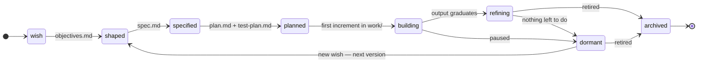

# Initiatives — a vision

**Status: draft for discussion. Nothing in this document is implemented.**

This describes a proposed third top-level concept for this repo, alongside `decks/`
and `demos/`. It is written to be read and argued with, not followed.

---

## 1. Why

`decks/` and `demos/` hold *outputs*. Nothing in the repo holds the *work that
produces them* or the *intent behind them*. Today a body of thinking — why a deck
exists, what it still needs, what the next step is — lives in chat sessions, in the
user's head, and in scattered prompt histories. It evaporates between sessions.

An initiative is the missing container for that. It makes intent durable, gives
half-formed ideas a legitimate place to sit before they are good enough to publish,
and — critically — gives an automated agent something to read so it can answer the
question "what should be done next?" without a human framing it every time.

## 2. What an initiative is

> **An initiative is a durable unit of intent, together with the work that pursues
> it and the capability it develops along the way.**

An initiative is not a project. A project ends. An initiative goes **dormant** and
can be revisited — a year later, to produce the next version of the thing, using the
tooling it built the first time.

An initiative holds three kinds of thing:

| | What it is | Lifetime |
|---|---|---|
| **Intent** | The wish, objectives, spec, plan, test plan — the elaboration chain | Grows monotonically; never deleted |
| **Capability** | Scripts, prompts, code libraries the initiative develops (skills normally live in `.claude/skills/`) | Outlives any single output; reused on revisit |
| **Outputs** | Pointers to what it actually produced | Graduates out of the initiative |

### 2.1 What an initiative can produce

- **One or more decks** of content in `decks/`.
- **A demo** — code that runs as a published example in `demos/`.
- **Code that executes elsewhere** — AWS, a ChatGPT GPT/site, or any environment
  outside this repo. The initiative holds the source and a pointer to where it runs.
- **Capability applied to existing content** — a skill, script, or library that gets
  embedded into a demo, or that *operates upon* decks (e.g. an auditor that checks
  every deck's map markers, or a generator that rebuilds a section).

That last one matters: **an initiative can produce no published artifact at all.**
Its output is capability. Those are still initiatives and still belong here.

## 3. Relationship to decks and demos

**Born inside, graduate out, capability stays.**

```
initiatives/night-sky/            decks/ , demos/                external
  wish.md                                                        (AWS, GPTs)
  spec.md
  work/            ──graduates──▶ demos/SBDC Night Sky/  ──┐
  lib/star-chart/  ──embedded in──────────▲                │
  skills/                                 │                │
  initiative.json  ────pointer to─────────┴────────────────┴──▶ recorded in outputs[]
```

1. Work-in-progress output is built under `initiatives/<name>/work/`. It is not
   published as a deck or demo, and not subject to deck/demo conventions, while it
   lives there.
2. When it is good enough, it **graduates** — moves to `decks/<name>/` or
   `demos/<name>/`, and from then on follows the normal conventions in `AGENTS.md`.
   The initiative keeps a pointer in `outputs[]`, not a copy.
3. **Most capability does not graduate with it.** `lib/` and `prompts/` stay
   in the initiative, because that is what makes the initiative revisitable. When the
   initiative wakes up to produce version 2, the tooling is right there.
   **Skills are the exception.** A skill is invoked by name by a user working
   interactively, and only `.claude/skills/` is discovered, so a skill filed under an
   initiative is one nobody can invoke. Skills therefore go to `.claude/skills/` by
   default; an initiative's own `skills/` is for a skill deliberately scoped to that
   initiative alone. See the Skills section of `AGENTS.md`.
4. If a library becomes broadly useful to *other* initiatives or decks, it graduates
   a second time — into `shared/`, under the existing opt-in-library convention.

| Output kind | Lives during development | Graduates to | Pointer recorded as |
|---|---|---|---|
| Deck content | `work/` | `decks/<name>/` | `{"kind":"deck","path":"decks/<name>"}` |
| Demo | `work/` | `demos/<name>/` | `{"kind":"demo","path":"demos/<name>"}` |
| External code | `work/` or `src/` | stays in initiative; deployed out | `{"kind":"external","url":"..."}` |
| Shared library | `lib/` | `shared/<lib>/` when widely used | `{"kind":"capability","path":"shared/<lib>"}` |
| Skill | `.claude/skills/<name>/` from the start | already there; nothing to graduate | `{"kind":"capability","path":".claude/skills/<name>"}` |
| Initiative-scoped skill | `skills/` by explicit choice | `.claude/skills/<name>/` if it turns out to be general | `{"kind":"capability","path":"initiatives/<n>/skills/x"}` |
| Prompt | `prompts/` | stays in the initiative | `{"kind":"capability","path":"initiatives/<n>/prompts/x"}` |

Nothing about existing decks or demos changes, and no migration is required.

### 3.1 A published output may not depend on initiative-internal code

Point 3 above has a hazard hiding in it. If `demos/migration_map/` loads
`initiatives/migration-atlas/lib/basemap/`, then a published demo depends on code that
is still being actively developed — and an ordinary edit inside the initiative silently
changes a published artifact, with no PR that appears to touch `demos/` at all.

So the boundary is a rule, not a convention:

> **Anything under `initiatives/` is mutable and private to its initiative. A published
> output may not reference it at runtime.**

When an output needs a capability, there are exactly two ways to ship it:

| | What happens | When to use it |
|---|---|---|
| **Graduate** | The library moves to `shared/<lib>/` and the output loads it from there | The capability is stable, and especially if anything else might want it |
| **Vendor** | A copy is committed inside the output, recording the source and the commit it came from | The capability is still moving, or is specific to this one output |

Vendoring records its origin in the output, so the copy is traceable:

```json
{ "vendored_from": "initiatives/migration-atlas/lib/basemap", "commit": "a1b2c3d" }
```

The initiative keeps developing its copy freely — that is the whole point of capability
staying behind (§3, point 3) — and the published output only changes when someone deliberately
re-vendors or the shared library is deliberately updated. §9 enforces this: no file
under a declared `outputs[]` path may reference a path under `initiatives/`.

## 4. Folder layout

```
initiatives/
  index.html           # generated — the Initiative TOC (§8.1)
  sweep.json           # sweep job configuration (§7.5)
  <initiative-name>/
    initiative.json    # required — the machine-readable state
    wish.md            # required — the original vague goal, in the user's words
    overview.md        # optional — hand-written prose, appended to index.html (§8.2)
    background.md      # optional — prior art and lessons, researched at birth (§7.10)
    objectives.md      # what "done" would mean, once it can be said
    decisions.md       # questions that were open, and how they were settled
    spec.md            # what it is
    plan.md            # how it gets built, in steps
    test-plan.md       # how we know it works
    log.md             # append-only record of what happened and when
    prompts/           # reusable prompts for ongoing work on this initiative
    notes/             # research, references, dead ends
    work/              # in-progress output, pre-graduation
    lib/               # code libraries this initiative develops
    skills/            # only a skill deliberately scoped to this initiative;
                       #   skills otherwise live in .claude/skills/
```

**Only `initiative.json` and `wish.md` exist at birth**, and the overview page is generated rather than committed (§8.2). Every other
document appears as the lifecycle advances. This is deliberate: **the absence of a
document is itself the signal for the next step.** An initiative with a wish and no
objectives has an obvious next action, and the sweep job (§7) can see it without being
told.

`background.md` is the one thing that may also be present at birth, and it does not
weaken that signal: no stage expects it, so its presence says nothing about what to do
next. It records what the world already offers and what similar attempts taught, at the
moment the wish is written — see §7.10.

### 4.1 `wish.md` is fixed at its first merge

`wish.md` holds the user's own words. It is **not** fixed the moment it is typed: while
the initiative is still in the pull request that creates it, the wish can be edited
freely — tidied, corrected, reworded, replaced outright. Nothing needs preserving,
because nothing has been agreed yet. Getting a half-formed thought into shape is what
that PR is *for*.

**The wish becomes the record when that PR merges.** From then on, elaboration happens
in `objectives.md` and later documents — never by quietly revising the wish. Months of
drift are exactly when the original *why* becomes most valuable and least recoverable.

This is the same rule the rest of the design already runs on: the merge is the event
that makes a thing real. It closes a todo item (§6.3), it advances a lifecycle stage
(§7.2), and it fixes a wish.

A revisit that produces version 2 **appends** a new dated wish rather than replacing the
first one, so the file becomes a chronological record of what was wanted and when.

**A merged wish may still be corrected — but the original stays visible.** Requirements
go wrong, and occasionally something needs removing. When a wish is changed *after* it
has been merged, the newest version goes at the top and the previous text is kept below
it, in the same file, plainly readable:

```markdown
# Wish

## 2026-11-03
Rebuild the atlas around migration *routes* rather than country totals.

---
### Superseded — 2026-08-12
A map showing where people moved, by decade.
```

This is not a revision history; git already has that, in more detail and with more
precision than any hand-maintained list. It is there for the reader. Seeing the earlier
wish directly above the current one is how you notice scope creep and drift — that the
thing you asked for in August is not quite the thing you are building in November. A
`git log` will not tell you that, because nobody runs `git log` on a wish.

## 5. Lifecycle



| Stage | What exists | What advances it | Typical next step |
|---|---|---|---|
| `wish` | `wish.md` — a vague goal, possibly one sentence | Turning desire into stated outcomes | Draft `objectives.md` |
| `shaped` | + `objectives.md` | Deciding what the thing actually *is* | Draft `spec.md` |
| `specified` | + `spec.md` | Breaking it into ordered work | Draft `plan.md` and `test-plan.md` |
| `planned` | + `plan.md` | Doing the first step | Build the first increment in `work/` |
| `building` | `work/` has real content | Reaching publishable quality | Next plan step, or graduate |
| `refining` | Output has graduated | Feedback, polish, follow-on versions | Work the todo list — entering seeds a README and a standing improvements PR (§6.5) |
| `dormant` | Nothing actionable, by choice — the only stage where an empty todo list is allowed (§6.4) | A new wish, or an external trigger | Nothing — this is a resting state |
| `archived` | Explicitly retired | — | Nothing, ever |

Two rules make the lifecycle useful rather than decorative:

- **Stages are declared in `initiative.json` and cross-checked against files present.**
  A validator flags `"stage": "specified"` with no `spec.md`.
- **Any stage can regress.** The diagram shows the common paths, but a `specified`
  initiative whose spec reveals the objectives were wrong should go back to `shaped`.
  Regression is normal and is not failure. The one exception is `archived`, which is
  terminal.

### 5.1 The second time around

"The absence of a document is the signal for the next step" (§4) works exactly once.
By the time an initiative reaches `refining`, every document exists, so file presence
says nothing about what to do next — and a revisit that regresses to `shaped` is
ambiguous, because `spec.md` is sitting there describing version 1.

The rule is simply that **file-absence signaling applies to the first pass only.**
After that the todo list carries the work, which is what it is for. Concretely, on a
revisit:

- **Documents are amended, not replaced.** `spec.md` gains a section for the new
  version; it does not get overwritten. The initiative accumulates, the way `wish.md`
  does (§4.1).
- **The regression is declared, not inferred.** Setting `stage` back to `shaped` is a
  deliberate edit that says "the objectives are open again", and the validator stops
  checking for missing files at that stage because they already exist.
- **The todo list is the only reliable signal from here on.** An initiative in
  `refining` with no actionable items is not finished — it is either dormant or
  neglected, which is exactly the distinction §9 warns about.

This is the weakest part of the lifecycle and the part most likely to need revision
after the first real revisit. It is written down so the revision is deliberate.

### 5.2 Mapping to the earlier Choice / Plan / Critique phases

The older phrasing maps cleanly, and it names two activities this lifecycle left
implicit:

| Earlier phase | Where it lands here | How it is represented |
|---|---|---|
| **Choice** — suggest alternative solutions, evaluate, recommend a leader | The transition `shaped` → `specified` | An **Alternatives considered** section in `spec.md` — options, evaluation, and the recommended leader with its reasoning. A large decision can have its own `alternatives.md`. |
| **Plan** — implementation plan, multiple phases, testing at each phase | The `planned` stage | `plan.md` broken into phases, with `test-plan.md` required at the same gate. "Testing at each phase" is why both documents advance the stage together rather than the test plan trailing. |
| **Critique** — identify issues in the plan and improve it | A standard todo item at `planned`, before `building` | A **"critique the plan"** item created automatically when `plan.md` first appears, with `advances_stage: false`. |

**Where a Choice is written down: `decisions.md`.** Each entry is dated and
appended — the question, the answer in the user's words, the alternatives with
their strengths and weaknesses, and what the answer leaves open. It is the
source `spec.md` draws its *Alternatives considered* section from, and the
reason a revisit (§5.1) does not re-argue a settled question. The
`answer-decision` skill writes it, so the format holds across sessions that
share no context.

Two things the earlier phases get right that this document had left unsaid:

- **Choice deserves to be written down.** A spec that records only the winning approach
  loses the reasoning, and a revisit (§5.1) then re-litigates decisions that were
  already settled — the exact failure initiatives exist to prevent. Alternatives
  considered is now an expected part of `spec.md`.
- **Critique is a step, not a mood.** Making it a real todo item means the sweep can
  rank it, it appears on the dashboard, and a plan cannot slide into `building`
  unexamined just because nobody remembered to look at it again.

Neither becomes a new lifecycle stage. Both are activities *within* the existing
transitions, which keeps the stage list short enough to hold in your head — the
property that makes it useful at a glance on the TOC.

## 6. `initiative.json`

Mirrors the existing `deck.json` convention — small, optional-where-possible, one file
per directory. Humans read the markdown; the job reads this.

```json
{
  "title": "Migration Atlas",
  "summary": "Interactive map of historical human migration, as a demo and a reusable map library.",
  "stage": "refining",
  "value": "high",
  "staleness_days": 21,
  "outputs": [
    { "kind": "demo",       "path": "demos/migration_map",     "status": "published" },
    { "kind": "capability", "path": "initiatives/migration-atlas/lib/basemap", "status": "internal" }
  ],
  "todo": [
    {
      "id": "add-1500-1800-layer",
      "title": "Add the 1500-1800 migration layer",
      "state": "actionable",
      "value": "high",
      "effort": "medium",
      "advances_stage": false
    },
    {
      "id": "test-plan",
      "title": "Write test-plan.md covering layer toggling and basemap fallback",
      "state": "actionable",
      "value": "medium",
      "effort": "small",
      "advances_stage": true
    },
    {
      "id": "source-african-data",
      "title": "Source pre-colonial African migration dataset",
      "state": "blocked",
      "blocked_by": "legal:redistribution rights for the Cambridge dataset",
      "value": "high"
    }
  ]
}
```

### 6.1 Field notes

- `stage` — one of the §5 values.
- `value` — `high` / `medium` / `low`. The initiative's own worth, used to rank across
  initiatives.
- `staleness_days` — optional per-initiative override of the global flag threshold
  (§7.5). A slow-burn initiative can set `90` and stop nagging; a hot one can set `3`.
- **There is no `updated` field.** Last activity is derived from git:
  `git log -1 --format=%cI -- initiatives/<name>/`. A hand-maintained timestamp is a
  field that can be forgotten, lied to, or left behind by an edit that touched only
  markdown — and git already records the answer exactly. Removing it removes a way for
  the state to be wrong.
- `todo[].state` — `actionable` or `blocked`. Completed items are removed and recorded
  in `log.md`, so the file stays short and always reads as "what's left".
- `todo[].blocked_by` — **required when blocked**, and namespaced — see §6.2.
- `todo[].advances_stage` — true when doing this item moves the initiative to the next
  lifecycle stage. These get a ranking boost, because a stalled lifecycle is the
  specific failure this system exists to prevent.
- `todo[].effort` — `small` / `medium` / `large`.

### 6.2 Why an item is blocked

"Waiting on a human" is only one reason, and treating it as the only one loses
information the job could act on. The blocker is namespaced so its *kind* is machine-legible:

| Prefix | Means | Example | How it clears |
|---|---|---|---|
| `todo:<id>` | **Precedent action** — an earlier item in this initiative must land first | `todo:build-basemap` | **Auto** |
| `initiative:<name>` | Cross-initiative dependency — another initiative must reach a stage | `initiative:map-library` | **Auto** |
| `review:<pr>` | Work is done, PR open, awaiting review | `review:#204` | **Auto** |
| `schedule:<date>` | Time-gated — cannot act before a date | `schedule:2026-11-01` | **Auto** |
| `human:<question>` | A decision only the user can make — taste, scope, priority | `human:which basemap style?` | Human |
| `permission:<what>` | Credentials, API key, OAuth grant, account, repo scope | `permission:AWS deploy role` | Human |
| `cost:<what>` | Needs spending approval or a paid tier | `cost:$40/mo tile service` | Human |
| `legal:<what>` | Licensing or rights clearance | `legal:dataset redistribution` | Human |
| `data:<what>` | A required input does not exist yet | `data:1500-1800 migration set` | Mixed |
| `external:<thing>` | A third party must act | `external:vendor API reaches GA` | External event |
| `upstream:<dep>` | Needs a version or feature of a dependency | `upstream:leaflet 2.0` | External event |

The three **clearance classes** are what make this worth the taxonomy:

- **Auto** — the sweep can verify the condition itself and flip the item to
  `actionable` with no human involvement. A `schedule:` date passes; a `review:` PR
  merges; a precedent `todo:` disappears. These should never sit blocked by accident.
- **Human** — only these belong in the escalation list (§8.4). Keeping them separate
  from the auto class is what keeps that list short enough to read.
- **External event** — nobody in this repo can clear it. The sweep re-checks
  cheaply where it can and otherwise leaves it alone; these should *not* count against
  an initiative's staleness, because waiting is the correct behaviour.

### 6.3 How todo items get removed

**Not by a GitHub Action after merge.** The PR that does the work also removes the
item and appends a line to `log.md`. Merging the PR is what enacts the removal.

This keeps the earlier guardrail intact while making it mechanically simple: the agent
*proposes* the closure, and the human merge *enacts* it. Concretely:

1. The sweep does the work, deletes the item from `todo[]`, appends to `log.md`,
   updates `updated`, and opens the PR.
2. In the same PR, any item whose `blocked_by` was `todo:<the removed id>` flips to
   `actionable` — a local, mechanical edit inside the same file.
3. If the PR is closed unmerged, nothing happened. State never diverged from reality,
   because the state change and the work were always the same commit.

Why not a merge-time Action:

- It needs write access to `main` and pushes a commit *after* every merge, which
  races with other merges and creates exactly the conflict class §7.6 exists to avoid.
- It needs the PR to declare which items it completed — a second source of truth
  (a trailer, a label) that can disagree with the diff.
- It breaks the "atomic" property: between merge and Action, the repo asserts that
  finished work is still pending.

The one place merge-time automation may still earn its place is **conflict
resolution** — rebasing or re-running the build for stale open sweep PRs. That is
mechanical and does not touch initiative state.

**Drift is caught by the validator, not by a bot.** If a human does work by hand and
forgets to remove the item, the next sweep sees it and can propose the cleanup. And
because a `blocked_by: todo:<id>` pointing at a nonexistent item is a build failure
(§9), a forgotten unblock cannot stay hidden — the build tells you.

### 6.4 How todo items get created, and the rule that an initiative may not run dry

§6.3 gave the system a way to remove items and no way to author one, so the todo
list could only ever run down. That is not a hypothetical: on 2026-08-20 three of
five initiatives sat with `"todo": []` — `tide-here` with a nine-phase `plan.md`
whose phases had never become items, `body-movement-visual-twin` parked at the
`specified` → `planned` gate, and `newsletter-story-harvester` genuinely finished
but never declared so. None of them looked broken. `select` had nothing to rank,
so the digest reported them as quiet rather than stalled, and the validator's
"nothing actionable, and not marked dormant" warning — the §5.1 distinction,
correctly detected — scrolled past unread every run.

**A warning read after the fact is not a guardrail.** By the time anyone reads it
the initiative has already gone silent, which is the failure it was meant to
prevent.

So two changes, both in `initiatives.mjs`:

- **`add <slug> <item-id> --title "..."`** — the missing primitive. It validates
  the vocabulary, refuses a duplicate id and a dangling `todo:` reference, and
  writes the fields the ranking depends on. Authoring items by hand-editing the
  JSON is what it exists to stop, for the same reason `complete` exists.
- **`complete` refuses to leave a live initiative with an empty todo list.** It
  names both ways out: seed what comes next with `add`, or say the initiative is
  finished with `--stage dormant`. Only `dormant` and `archived` may have nothing
  to do, because at those stages an empty list is a statement rather than an
  omission.

The rule is one sentence: **an initiative may not be left with nothing to do
unless someone has decided it is finished.** §5.1's distinction between dormant
and neglected stops depending on anyone noticing.

Note what this does *not* do: it never invents the next item. It refuses, and
makes the person or agent closing the last item say what comes next — which is
the judgement the sweep should not be making anyway (§7.7).

### 6.5 What entering `refining` creates

One transition is exempt from "never invents an item", because at exactly one
point in the lifecycle the next work is predictable. `refining` means the output
has graduated (§4) and now has an audience — and an output with an audience
reliably lacks two things, neither of which arrives on its own. So
`complete --stage refining` seeds them as items rather than hopes:

- **`refining-readme`** — a user-facing README: **how to use it** and **how to
  deploy it**. Everything written up to this point — objectives, spec, plan — is
  addressed to whoever is *building* the thing. Nothing in the lifecycle has ever
  asked for a document addressed to whoever *uses* it, and the moment it
  graduates is the moment that gap starts costing something.
- **`refining-improvements`** — a standing pull request of optional improvements.
  It may be as little as better documentation, or features suggested outright.

The improvements item is the more unusual of the two, and it is deliberate. A
finished-looking thing attracts no suggestions, because suggesting one means
composing it from a blank page — the same asymmetry §7.8 uses to justify
proposing answers rather than asking questions. **Reacting to a proposal is far
cheaper than originating one.** An open PR full of candidate improvements gives
the user something to react to: better ideas in a comment, a redirect, a new
conversation, or nothing at all. What it does not give them is silence.

Two properties keep this from becoming noise:

- **It is labelled optional, and none of it advances the stage.** The PR is a
  menu, not a plan. Closing it unmerged is a legitimate outcome and leaves no
  wreckage.
- **It ends when the user says it ends.** Because §6.4 forbids an empty list at a
  live stage, completing the improvements item forces either another round or
  `--stage dormant`. So a refining initiative always has an open invitation until
  the user declares it done — which makes going dormant an explicit act, exactly
  as §5.1 wanted.

## 7. The sweep job

A scheduled agent runs **several times a day** across all initiatives — four times at
present, twice in the original design. Four phases, in order —
and the order is the design: look at everything, finish what is in flight, unblock what
is stuck, then start something new.

### 7.1 Phase 1 — Survey (always)

**The survey is code, not a prompt.** Everything below is *derived* from
`initiative.json`, the files present, and git — none of it needs judgement — so it is
computed by `node scripts/initiatives.mjs digest` rather than reasoned out. That makes
it instant, free, unit-testable, and unable to hallucinate a blocker or miss a stale
initiative. A model is only needed once the sweep starts doing work, which is why
**Phase 4 of the adoption path requires no model at all**.

The one exception is a `review:` blocker: clearing it means asking GitHub whether a
pull request closed, so those are listed for a caller that can check.

Read every `initiative.json`, derive state, and produce a **digest**:

- every initiative, its stage, and days since last activity
- its single top-ranked actionable item
- **every human-class blocker (§6.2), gathered into one list** — the most valuable
  part of the digest, because it is the only thing the job genuinely cannot resolve
- auto-class blockers whose condition is now satisfied, flipped to actionable
- initiatives past their staleness threshold but not marked dormant
- initiatives with zero actionable items that are not marked dormant — a defect

### 7.2 Phase 2 — Respond to review

A sweep PR that comes back with comments is **work in flight, not work finished**.
Without this phase it is a dead end: §7.7.1 excludes an item that already has an open
PR, so nothing would ever pick it up again and the revision would fall to you by hand —
exactly the friction this design exists to remove.

So before starting anything new, the sweep walks its own open PRs and answers what has
come back. **Finishing work in flight outranks starting more**, which also means
revisions drain the queue that new work fills (§7.5).

The rules below live in a skill, `.claude/skills/respond-to-review/`, so the sweep
prompt can call it rather than restate it — and so you can run the same logic by hand
on any PR, initiative-related or not. It is the middle of three: `new-initiative`
starts work, `respond-to-review` iterates on it, `merge-prs` finishes it.

#### What counts as needing a response

A review thread whose most recent comment is **from a human**, with no reply and no
commit newer than it. Explicitly not: threads the sweep itself last touched, resolved
threads, outdated threads on code that has since changed, approvals, or comments from
bots.

#### Three outcomes, not one

| Outcome | When | What it does |
|---|---|---|
| **Revise** | The change is inside the write scope (§7.6) and within `max_effort` | Push a commit to the PR branch, and reply saying what changed |
| **Reply only** | A question, a disagreement, or a request outside the write scope | Reply and explain; no commit |
| **Escalate** | A design decision the sweep should not make alone | Reply saying so, and raise it in the digest as a human-class blocker |

Treating every comment as a change request is the obvious failure here. "Why did you do
it this way?" deserves an answer, not a rewrite.

#### It never resolves a thread

The sweep replies and pushes; **you** decide the conversation is over. Same rule as the
merge skill (§7.9), for the same reason: resolving your own review threads is how a
safeguard stops meaning anything.

#### It does not let a PR balloon

If a comment asks for materially more than the item the PR was opened for, the sweep
proposes a **new todo item** rather than growing the diff. A review comment is allowed
to create work; it is not allowed to silently redefine what is already in flight.

#### Termination

The loop hazard is real, and it is the same class of bug as the duplicate PRs in
§7.7.1: a reply is itself activity, so without a stopping rule the sweep can answer
itself indefinitely. Two halves, both required:

1. **The sweep never treats its own comments as input.** Self-authored and bot comments
   are invisible to it.
2. **A thread is addressed** once there is a reply *or* a commit newer than its last
   human comment.

#### The stage does not move

An initiative whose `spec.md` PR is open is still at `shaped` — not because this phase
holds it there, but because §6.3 makes the merge the event that enacts a state change.
The stage advances when the PR merges, however many review rounds it takes. No new rule
is needed; this falls out of what is already there.

Every round appends to `log.md`, so an initiative's history shows the revisions, not
just the eventual merge.

### 7.3 Phase 3 — Propose an answer

An open question costs a blank page. That is the expensive kind of work to leave
to a person, and it is the reason initiatives sit at `shaped` for weeks.

So for a question the sweep can reason about, it does the reasoning and opens a
pull request: the alternatives, an evaluation, a recommended answer, and the
`decisions.md` entry already written (§5.2). Merging it *is* answering. A comment
redirects it, which `respond-to-review` already knows how to handle.

The asymmetry is the point: **judging a proposal is far cheaper than composing an
answer.** Reviewing four evaluated options and replying "do B" is a minute's
work; deriving those four options from scratch is an afternoon.

#### Only judgement is proposable

`human:` currently conflates two different things, and only one of them can be
proposed:

| Kind | Example | Proposable |
|---|---|---|
| **Judgement** — a choice among options that can be reasoned about | `human:local script, web app, extension, or hosted?` | **Yes** |
| **Information only the user has** — use `data:` | `data:how large is the real pile?` | **No** — proposing means fabricating |
| **Authority** — `permission:`, `cost:`, `legal:` | `cost:approve $40/mo for tiles` | **No** — needs consent, not reasoning |

This sharpens a distinction the taxonomy already had rather than adding one: use
`human:` for a judgement call, and `data:` when what is missing is a fact about
the user's world. A proposal for a `data:` blocker would be an invention wearing
the costume of an answer.

**The sweep may propose only for `human:`.** Never for `data:`, `permission:`,
`cost:`, or `legal:`.

#### The hazard: a proposal is more persuasive than a question

A blank question makes you think. A well-argued proposal makes you agree. A
plausible-but-wrong answer that arrives with three paragraphs of reasoning is
*harder* to catch than no answer at all — the reasoning is exactly what stops
you generating your own.

This is not fixed by resolving to read carefully. It is fixed by structure, so
the PR body must:

1. **Put the alternatives before the recommendation**, each with its strengths
   and weaknesses, so the choice is visible before the conclusion is.
2. **Label the recommendation as a recommendation**, not a decision.
3. **State what would change the answer** — the fact or preference that would
   make a different option correct. This is the sentence that lets you notice
   the proposal rests on an assumption you know to be wrong.
4. **Make disagreement one line.** Naming a different option in a comment has to
   be enough; if redirecting costs a paragraph, the default wins by attrition.

#### Main is unchanged until it merges

The proposal PR does **not** rewrite the blocker on `main`. The item stays
`blocked_by: human:…` until the PR merges, at which point the PR's own change
lands — the same rule as everywhere else here: the merge enacts (§6.3).

That falls out well:

- **A closed, unmerged proposal leaves no wreckage.** Nothing was changed, so the
  question simply remains open. Had the proposal flipped the blocker to
  `review:<pr>` up front, closing the PR unmerged would auto-clear it (§6.2) and
  mark an unanswered question as answered — a stuck item that looks finished.
- **No duplicate proposals**, because §7.7.1's open-PR check already excludes an
  item that has one.
- **The digest keeps listing it**, which is correct. It is still your decision;
  what changed is that there is now something to react to instead of something
  to compose.

#### What the digest still carries

This gives the digest issue (§8.4) a sharper job rather than a smaller one. Once
judgement questions arrive as pull requests, what remains in the issue is the
residue that **never** becomes a PR:

- `data:` — facts only you can supply
- `permission:`, `cost:`, `legal:` — things needing your authority

Those are precisely the items no amount of model effort can advance, so an issue
listing only them is a list where every entry genuinely requires you. That is a
better list than one mixing them with questions a proposal could have answered.

#### Budget and limits

A proposal counts against `items_per_run` like any other item, and against
`max_items_per_initiative`. It is ordinary work that happens to produce a
decision rather than a document.

> **What was built.** `initiatives.mjs propose` selects the questions, ranking
> them exactly as `select` ranks work and sharing the same caps; both take
> `--spent` so the shared budget is arithmetic rather than a thing the prompt
> has to remember. Two details are decided here rather than left to the model:
> `max_effort` does not apply, because composing a proposal is not doing the
> item, and a proposal branch is `sweep/<slug>/propose-<item-id>` so it cannot
> collide with the item's own work branch once the answer merges and the item
> unblocks. Non-proposable human-class blockers are returned in a separate list,
> which is exactly the residue §8.4 says the digest issue is left carrying.

### 7.4 Phase 4 — Do new work (each run)

Take the **top-ranked actionable items across all initiatives**, up to a configured
budget, do the work, and open PRs. Never self-merged.

Ranking, roughly:

```
score = value(initiative) × value(item) ÷ effort(item)
        + stage_gate_bonus     (item advances the lifecycle)
        + staleness_bonus      (initiative untouched for a long time)
```

The stage-gate and staleness bonuses exist to keep the job from grinding on one active
initiative's easy wins while three others sit at `wish` forever.

### 7.5 The work budget

How much a sweep may do is configured **in the repo**, not baked into the job or passed
at the call site — so changing throughput is a reviewable commit, and the job's
behaviour is readable from the repo alone.

`initiatives/sweep.json`:

```json
{
  "phases": ["survey"],
  "items_per_run": 4,
  "max_items_per_initiative": 2,
  "max_effort": "large",
  "staleness_days": 14,
  "max_open_prs": 8,
  "pr_strategy": "one-per-initiative",
  "protected_paths": ["shared/", "scripts/", ".github/"]
}
```

| Field | Default | Meaning |
|---|---|---|
| `phases` | `["survey"]` | What a run may do: `survey`, `respond`, `propose`, `work`. Must include `survey` |
| `items_per_run` | `4` | Total actionable items a single sweep may complete |
| `max_items_per_initiative` | `2` | Cap per initiative, so one hot initiative can't eat the whole budget |
| `max_effort` | `large` | Largest item the job may attempt unsupervised |
| `staleness_days` | `14` | Days without activity before an initiative is flagged; overridable per initiative (§6.1) |
| `max_open_prs` | `8` | Ceiling on unmerged sweep PRs; at the cap the sweep does no new work (§7.7.1) |
| `pr_strategy` | `one-per-initiative` | How completed items are packaged (§7.6) |
| `protected_paths` | `shared/`, `scripts/`, `.github/` | Paths a sweep PR may never touch unattended (§7.6) |

**`phases` is how the sweep is switched on, one capability at a time.** Enabling
`respond` or `work` is a reviewable commit to a config file, not an edit to a prompt —
the same reasoning that puts the budget here rather than at the call site.

> **Where it stands.** The block above is the default the design proposed. The
> live `initiatives/sweep.json` now reads
> `"phases": ["survey", "respond", "propose", "work"]` with every other value as
> shown — Phases 5, 5a and 6 of §12, landed together. Turning a capability back
> off is the same reviewable commit that turning it on was.

Three notes on these values:

- **`max_effort: "large"`** — the effort scale is `small`/`medium`/`large`, deliberately
  different words from `value`'s `high`/`medium`/`low` so that "high value, large
  effort" cannot be misread. `large` here means no effort ceiling: the job may attempt
  anything on the list.
- **`max_open_prs` is set to 8, twice `items_per_run`.** With a budget of 4 and a cap of
  4, a single run would hit the ceiling and the next would do nothing — the cap has to
  leave room for at least one more run's worth of work, or it stops being a safety valve
  and becomes the actual budget.
- **`max_items_per_initiative: 2` is what makes a budget of 4 safe.** Without a
  per-initiative cap, four items from one initiative would likely conflict, since plan
  steps within an initiative tend to be sequential. At 2, a full run spreads across at
  least two initiatives.

**Review responses come out of the same budget, taken first.** One number rather than
two, because the precedence then produces the right behaviour on its own: a run that
spends all four on revisions and starts nothing new is not a degraded run, it is the
correct one. A second `revisions_per_run` dial would let new work continue while the
review queue grew, which is the failure this ordering exists to prevent.

### 7.6 PR isolation — why one per initiative avoids conflicts

At full budget a run could open one PR per initiative. That is safe only if the PRs
touch disjoint files, so the rule is a **write scope**, not just a packaging preference:

> A sweep PR may modify `initiatives/<NAME>/**` and that initiative's declared
> `outputs[]` paths. Nothing else.

Three tiers of risk, and how each is handled:

| Paths | Conflict risk | Rule |
|---|---|---|
| `initiatives/<NAME>/**` | **None** — single owner by construction | Freely writable |
| Declared `outputs[]` (e.g. `demos/migration_map/`) | None *if* ownership is exclusive | Writable, and §9 enforces that no two initiatives declare the same output path |
| `shared/`, `scripts/`, `.github/` | **Real** — many initiatives may want to touch these | `protected_paths`: excluded from unattended work; such an item is escalated to the digest instead |

The second row is the wrinkle in "limit each PR to `initiatives/NAME/`": once an output
graduates, real work on it lands in `decks/` or `demos/`, outside the initiative folder.
Isolation still holds — but it now depends on **exclusive output ownership**, which is
why that becomes a validated invariant rather than an assumption.

Two consequences worth stating:

- **Generated pages are never committed.** The Initiative TOC and each `index.html`
  are produced into `gh-pages/` at build time (§8), so they are not a shared file that
  every PR would edit — which is precisely what would reintroduce conflicts at scale.
- **Graduation is not unattended work.** Moving `work/` into `decks/` or `demos/` is a
  large structural change that creates a new exclusively-owned path. It should be a
  human-triggered item, or at minimum the only item in its run.

If every open sweep PR respects the write scope, they merge cleanly in any order — which
is the whole point of paying for the isolation rule.

### 7.7 Guardrails

- **Never exceeds the configured budget**, and never merges its own work.
- **Never writes outside its write scope** (§7.6).
- **Never opens a second PR for an item that already has one open** (§7.7.1).
- **Never invents a wish.** It elaborates existing intent; it does not create new
  initiatives.
- **No actionable work anywhere → it does nothing** and says so in the digest. A quiet
  run is a correct run.
- **Human-class blockers are escalated, not guessed at** — as multiple choice wherever
  the options are enumerable.
- Every run appends to each touched initiative's `log.md`.

#### 7.7.1 In-flight work — the duplicate-PR hole

An item stays in `todo[]` until its PR merges (§6.3). That is correct for state, but it
means **`main` still shows the item as actionable while the PR is open** — so the next
run, twelve hours later, ranks it top again and does it a second time. Left alone, an
unmerged PR would be re-created every sweep until it merged.

The fix is a check, not a field. State written inside the PR branch cannot help, because
the sweep reads `main`; so before selecting anything, the sweep **lists its own open PRs
and excludes every item already addressed by one** from *new* work. Branch naming carries
the mapping:

```
sweep/<initiative>/<item-id>
```

No trailer, no label, no second source of truth — the branch name *is* the record, which
is the same standard §6.3 applies to merge-time automation.

**Excluded from new work is not the same as ignored.** An open PR that has picked up
review comments is claimed by Phase 2 (§7.2), which revises it. The exclusion here only
stops the sweep opening a *second* PR for the same item; it never means the PR is
abandoned.

Two consequences worth stating:

- **A stalled PR stalls only its own item.** The initiative's other actionable items
  remain eligible, so an unreviewed PR slows one thread rather than the whole initiative.
- **`max_open_prs` caps the pileup.** At the ceiling the sweep does no new work and says
  so in the digest — though it still responds to review, since that drains the queue
  rather than adding to it. This is the real answer to "four runs a day could mean
  twenty-eight PRs a week": it cannot, because unmerged work blocks its own item and the
  cap stops the rest — and it holds at any frequency, which is why the schedule is a
  setting rather than a design parameter.

### 7.8 Where it runs

**Claude Code or Codex**, on a schedule — either is workable, and the design deliberately
depends on neither. What the host must provide is repo write access, branch and PR
creation, and a cron. A GitHub Actions workflow, or a Claude Code on the web Routine,
both qualify.

The one piece that is a natural fit for **GitHub Actions specifically** is the
merge-related mechanical work noted in §6.3: rebasing stale sweep PRs, re-running the
build after a merge, and closing PRs whose initiative was archived. That work is
triggered by repo events rather than by a clock, and it needs no model at all.

#### 7.8.1 The prompt, and how it is invoked

**The prompt lives in the repo, at `initiatives/sweep-prompt.md`.** The scheduler does
not hold a copy — it reads that file. This matters for exactly the reason you raised:
a manual run during development and the scheduled run must be *the same prompt*, or
debugging the schedule means debugging a text you cannot see. It also makes
changes to the job's behaviour reviewable, like `sweep.json` (§7.5).

Manual invocation is then just:

```bash
claude -p "$(cat initiatives/sweep-prompt.md)"
```

or, in an interactive session, *"run the sweep prompt"*. A scheduled run is the same
text on a cron. During development, add `--dry-run` semantics by appending one line:
*"Stop after Phase 1 and print the digest; do not create branches or PRs."*

The prompt itself, as first drafted. **The live text is
`initiatives/sweep-prompt.md`**, which has since gained the propose phase (§7.3)
and now numbers new work as Phase 4; it also calls `select` and `propose` rather
than restating the ranking rules, since those are computed. This copy is kept as
the design sketch — when the two disagree, the file in `initiatives/` is the one
that runs.

```markdown
Run a sweep of the initiatives in this repository.

## Phase 1 — Survey (always)

1. Read `initiatives/sweep.json` for configuration. If it is missing or malformed,
   stop and report that.
2. For every immediate subdirectory of `initiatives/`, read `initiative.json`.
   Skip and report any that is missing or does not parse — never repair one.
   Compute last activity with:
   `git log -1 --format=%cI -- initiatives/<name>/`
3. Auto-clear blockers whose condition is now satisfied, setting the item to
   `actionable`:
   - `todo:<id>` where `<id>` no longer exists in that initiative
   - `review:<pr>` where that PR is merged or closed
   - `schedule:<date>` where the date has passed
   - `initiative:<name>` where that initiative has reached the named stage
4. Build the digest:
   - per initiative: stage, days since last activity, top actionable item, blocked count
   - one combined list of every human-class blocker (`human:`, `permission:`, `cost:`,
     `legal:`), each naming the initiative and the decision needed
   - initiatives past `staleness_days` and not dormant
   - non-dormant initiatives with no actionable item
   - any initiative skipped for malformed state

## Phase 2 — Respond to review

Use the `respond-to-review` skill for each PR below; it holds the detailed rules.

5. List open PRs whose branch matches `sweep/*`. For each, find review threads whose
   most recent comment is from a human and that have no reply and no commit newer
   than that comment. Ignore your own comments, bot comments, resolved threads,
   outdated threads, and approvals.
6. For each such thread, do one of three things, and reply in every case:
   - **Revise** — if the change is inside the write scope and within `max_effort`,
     push a commit to that PR's branch and reply saying what changed.
   - **Reply only** — for a question, a disagreement, or a request outside the write
     scope.
   - **Escalate** — for a design decision you should not make alone: reply saying so,
     and add it to the digest as a human-class blocker.
   Never resolve a thread. If a comment asks for materially more than the item the PR
   was opened for, propose a new todo item instead of growing the diff.
7. Append a dated line to the initiative's `log.md` for each PR you revised. Do not
   change the initiative's `stage` — the merge does that, however many rounds it takes.

Each thread you handle counts against `items_per_run`.

## Phase 3 — Do new work

8. Exclude every todo item that already has an open `sweep/*` PR. If the count of open
   sweep PRs is at or above `max_open_prs`, or the budget is already spent on review
   responses, stop here and report the digest.
9. Rank the remaining actionable items across all initiatives:
   `score = value(initiative) x value(item) / effort(item)`
   plus a bonus if `advances_stage` is true, plus a bonus scaled by staleness.
   Drop any item whose effort exceeds `max_effort`.
10. Select the top items up to the remaining budget, taking no more than
    `max_items_per_initiative` from any one initiative.
11. For each selected item, work on branch `sweep/<initiative>/<item-id>`:
    - Do the work. Write only inside `initiatives/<name>/` and that initiative's
      declared `outputs[]` paths. Never touch anything in `protected_paths`.
    - Remove the completed item from `todo[]`.
    - Flip any item blocked on `todo:<completed-id>` to `actionable`.
    - Append a dated line to `initiatives/<name>/log.md` saying what was done.
    - Open a pull request. Do not merge it.
12. Report the digest, including what was done, what you revised, and the PR links.

## Rules

- Never merge your own pull request, and never resolve a review thread.
- Never treat your own comments, or another bot's, as something to respond to.
- Never create a new initiative, and never invent or edit a wish.
- Never repair a malformed `initiative.json` — skip that initiative and report it.
- Never resolve a human-class blocker by guessing. Put the decision in the digest,
  as multiple choice wherever the options can be enumerated.
- If there is no actionable work anywhere, do nothing and say so. A quiet run is a
  correct run.
```

### 7.9 Merging the output — the merge skill

A job that runs several times a day, turning every few hours into PRs that must each be
reviewed and merged by hand, is the most likely way this system dies. The fix is a repo skill, so clearing a
batch is one sentence rather than a browser session.

`.claude/skills/merge-prs/SKILL.md`, invoked as *"use the merge skill to merge PRs 231,
234, 236"* or `/merge-prs`. For each target it:

1. **Resolves the target set** — explicit numbers, or a selector: `all green sweep PRs`,
   `today's sweep`, `initiative:migration-atlas`.
2. **Checks before touching anything** — open and not draft, CI concluded green,
   `mergeable_state` clean, no unresolved review threads.
3. **Classifies** each into ready / CI-red / conflicted / has-unresolved-comments /
   already-merged.
4. **Merges the ready ones** (squash, delete branch) and leaves the rest alone.
5. **Reports one table** of what merged and why each skipped PR was skipped.

Two rules keep it safe: it **never merges anything not green** without an explicit
override, and it **never resolves a review thread** to make a PR mergeable — an
unresolved comment means you were still talking, and that outranks throughput.

The selector is where the friction actually goes away. `merge all green sweep PRs`
clears a whole day's batch in one sentence, and because sweep PRs are path-disjoint by
§7.6, they merge cleanly in any order.

**A conflict between two sweep PRs is a bug report, not a nuisance.** The write scope
in §7.6 is supposed to make conflicts structurally impossible. If the merge skill hits
one, an initiative wrote outside its scope or two initiatives declared the same output
path — so the skill should say that loudly rather than quietly rebasing past it. The
merge tool doubles as the detector for the invariant that makes the whole parallel
design work.

**What not to do instead: GitHub auto-merge on green.** It looks like the obvious
friction fix, but §6.3 makes the human merge the event that closes a todo item.
Auto-merging on CI green would make "review enacts closure" vacuous — items would
close because the build passed, which tests nothing about whether the work was any
good. The merge skill keeps the human decision and removes only the clicking.

### 7.10 Creating an initiative — the new-initiative skill

The sweep never invents an initiative (§7.7), so creation is always deliberate. That
makes the blank page the system's real bottleneck: if starting one means remembering
three files and a JSON schema, half-formed ideas will keep going into chat instead —
which is the exact problem §1 says initiatives exist to solve.

`.claude/skills/new-initiative/SKILL.md`, invoked as *"use the new-initiative skill for
an idea about …"*. It asks for the wish in your own words, proposes a slug, and
scaffolds the minimum:

- `initiative.json` — `stage: "wish"`, a title and summary, empty `outputs`, and **one
  actionable todo: draft `objectives.md`** (`advances_stage: true`), so the initiative
  is legal under §9 from the moment it exists
- `wish.md` — your words, verbatim, dated (§4.1)
- `index.html` — the generated overview shell

Nothing else. No spec, no plan, no empty directories — those arrive when the lifecycle
reaches them.

> **What was built, and one addition.** The `index.html` line above is wrong — pages are
> generated, never committed (§8.2), so the skill scaffolds two files. It also asks about
> `value` and the one-line `summary`, and — the addition — whether to **look around before
> starting**: nothing (the default), prior art, lessons from similar attempts, or both.
>
> The research lands in `background.md`, in the same pull request as the wish. That
> placement is the whole point of it. A wish is editable right up to the merge that fixes
> it (§4.1), so arriving with the background *beside* the wish is the one moment when
> learning that four products already do this, or that the last three attempts died on the
> same rock, can still change what is being asked for — at no cost, with nothing to
> supersede. A week later the same finding is an amendment.
>
> Two rules keep it from becoming something else. It states findings and never
> recommendations: the stage stays `wish`, the one todo item is still *draft objectives*,
> and judgement belongs in the documents that draw on this one. And it never edits the
> wish — it reports, and the user decides. Silently reshaping a wish to fit what was read
> produces an initiative nobody wished for, which is a worse failure than not researching
> at all.
>
> Finding nothing is a result worth recording. "Nobody appears to be doing this" is
> information the objectives should be written in light of, and it is only legible if the
> file is not padded with near-misses.

**Build it before the first initiative is written**, as you suggested. The first
initiative is then a test of the skill as well as of the schema, and Phase 1 stops
being hand-work that has to be repeated correctly from memory every time afterwards.

### 7.11 Running alongside another agent

Some work has to happen where the tooling is — deploying and revising a ChatGPT Sites
build has to be tried in that environment, not described from here — so a second agent
will sometimes be working on an initiative while the sweep runs. **This needs no new
mechanism**, because three properties already established carry it:

- **The sweep never merges (§7.7).** A collision costs a pull request you close, not a
  corrupted `main`.
- **Every run re-derives its picture from `main` (§7.1).** There is no cached state to
  go stale, so the run after someone else's merge simply sees the new state. "Claude's
  sweep discovers what happened" is the design working, not a recovery path.
- **`initiative.json` is the only ledger (§6.3).** Drift is caught by the validator, and
  `complete` errors rather than half-applying when an item is already gone.

What it costs is two conventions, both free: whoever finishes an item records it with
`complete`, and both agents name branches `sweep/<initiative>/<item-id>` — since the
branch name *is* the claim (§7.7), a different prefix is invisible to the duplicate-work
exclusion and to `max_open_prs`. `initiatives/sweep-setup.md` carries the operational
detail.

**The one real limit is semantic, not mechanical.** Git shows you a textual collision;
nothing detects a merged decision that invalidates the premise of the other agent's open
pull request while touching a different file. So the rule is to split by *initiative*
rather than by file, and the exclusive-output-ownership check (§9) is what makes that
split hold once an initiative writes code outside `initiatives/`.

**Deferred: a designation mechanism.** A field saying which agent owns an initiative, or
an item, is the obvious next step, and is deliberately not built yet. Two conventions and
a habit are cheaper than a schema field, and the field is only worth adding once the
habit demonstrably fails — most likely when the same item is picked up twice despite
matching branch names, or when a third agent joins. Recording the deferral here so the
next reader knows it was a decision rather than an oversight.

## 8. Publishing

The site gains a third TOC, parallel to decks and demos. This **extends the earlier
"dashboard only" decision**: individual initiative overview pages are now published
too, though raw working documents remain repo-first (§8.3).

### 8.1 The Initiative TOC

`scripts/build.sh` generates `gh-pages/initiatives/index.html` from every
`initiative.json`, in the same spirit as the existing Demo TOC.

The page opens with a **condensed statement of what initiatives are and why they
exist** — a few sentences distilled from §1 and §2 of this document, not a link to it.
Someone arriving at the TOC cold, including a future version of you, should not have to
find a design document to understand what they are looking at. Concretely: initiatives
are durable units of intent; they progress through a lifecycle from wish to refinement;
they produce decks, demos, code that runs elsewhere, or reusable capability; and they
carry a todo list that an agent sweeps several times a day. Roughly a short paragraph and the
lifecycle sequence, in a collapsible topic so it stays out of the way once it's familiar.

Then one entry per initiative, each with a brief description, a brief status, and a link
to `initiatives/<NAME>/index.html`:

| Initiative | Stage | Status | Outputs |
|---|---|---|---|
| [Migration Atlas](#) | refining | Next: add 1500–1800 layer · 1 blocked (legal) · 2 days ago | [demo](#) |
| [Night Sky](#) | building | Next: fix mobile star labels · 9 days ago | [demo](#) |
| [Deck Auditor](#) | wish | **Next: write objectives.md · stale, 34 days** | — |

Stale entries and entries with zero actionable items are visually flagged. This is the
at-a-glance answer to "what is going on across everything", readable on a phone.

### 8.2 Per-initiative `index.html`

Every initiative has one, and it is the front door to that initiative:

- **Purpose** — the wish and the current objectives, in a sentence or two
- **Status** — stage, time in stage, last activity
- **What's next** — the actionable items, ranked
- **What's blocked** — each with its blocker and clearance class (§6.2)
- **Outputs** — links to the published deck/demo/external artifact
- **Documents** — links to `wish.md`, `spec.md`, `plan.md`, `test-plan.md`, `log.md`

Following the existing deck convention, the page is built from topics and gets
collapsible sections for free.

**All of the above is generated** from `initiative.json` and the files present, so
status cannot drift from reality. On top of that, an initiative **may** have an
`overview.md` — hand-written prose that is rendered and appended to the built page.

`overview.md` is **allowed but never required**. Most initiatives will not have one;
a wish and a generated status block are enough. It earns its place when an initiative
needs a real narrative — the reasoning behind an approach, what was tried and rejected,
context a newcomer needs. When absent, the page simply omits the section.

A separate file rather than a long markdown string in `initiative.json`, for three
reasons: JSON cannot hold readable multi-line prose, so it would arrive as one
enormous escaped line; that line would produce a useless diff on every edit; and a
`.md` file renders on GitHub for free, while a string buried in JSON renders nowhere.
This also keeps the split clean — `initiative.json` is state the machine owns,
`overview.md` is narrative the human owns, exactly as elsewhere in this design.

### 8.3 How markdown documents get displayed

The question was whether important documents should be HTML instead of markdown, or
kept as parallel HTML, or rendered by a JavaScript widget. Four options:

| Approach | Advantages | Issues |
|---|---|---|
| **A. Author in HTML** | Renders everywhere with zero machinery | Markdown is far better for agents to edit and for git to diff; HTML diffs are noisy; raises the cost of writing a wish |
| **B. Parallel committed HTML** | Renders everywhere; no JS | Two files per document that *will* drift; doubles every diff; a generated file in the tree is a merge-conflict surface — exactly what §7.6 avoids |
| **C. JS markdown widget** | Single source of truth; zero build change; fits the existing `shared/` library idiom exactly | Needs `fetch()`, so `file://` browsing breaks; a brief render flash; no-JS readers see nothing |
| **D. Render at build time** | Single source of truth; no JS; nothing generated is committed | Adds a markdown dependency to the build; docs are only readable after a build+deploy |

> **What was built: D.** Validation made this part of the build Node anyway, which is
> the condition named below for preferring D. Documents are rendered at build time by
> `scripts/initiatives.mjs`; there is no `markdown_view` library. The `.md` files remain
> the source of truth, so the choice stays reversible. The original recommendation is
> kept below for the reasoning.

**Recommendation: C, a `shared/markdown_view/` library**, matching the established
pattern of `photo_gallery`, `standard_map`, and `collapsible_topics` — a widget that is
easy to get wrong by hand, implemented once, opted into. `.md` stays the single source of
truth, which also means the documents render natively on GitHub with no work at all.
D is the credible runner-up and becomes more attractive if the build already grows a
markdown dependency for another reason.

The decision is **low-stakes and reversible**: as long as `.md` remains the source of
truth, switching between C and D later changes only how pages are produced, not what is
written. Rule out A and B — those are the ones that are expensive to undo.

### 8.4 Where the digest goes

Three candidates, with the honest trade-offs:

| Approach | Advantages | Issues |
|---|---|---|
| **GitHub issue, rewritten each run** | Push notifications; mobile; a comment thread to reply in; assignable and closable; no repo churn | Rewriting destroys history, or leaves an unreadable edit log; notifies twice daily whether or not anything changed — the fast path to being ignored; lives outside the repo |
| **Committed `DIGEST.md`** | Versioned and diffable; `git log` shows how the picture changed | Two commits a day to `main` forever; a shared file every sweep wants to edit, reintroducing §7.6 conflicts; no notification |
| **Dashboard page only** | No churn; always current; visual; already being built for §8.1 | No push; no history; only ever shows *now*; needs a deploy to refresh |

**Recommendation: the dashboard is the canonical view, plus one persistent GitHub issue
that is updated only when the set of human-class blockers changes.**

The reasoning: the dashboard is being built anyway, so the routine "here is the state of
everything" view costs nothing extra and is the right medium for something that is only
ever consulted in the present tense. History is already covered — per-initiative `log.md`
is versioned, diffable, and lives where the context is, which is what `DIGEST.md` was
really for.

That leaves notification, which is the one thing a page cannot do. Reserving the issue
for *changes in human-blocker set* means a quiet run is genuinely silent, and a
notification always means "you specifically are now the bottleneck." Notification
fatigue is the actual failure mode of a twice-daily job, and this is the design that
avoids it.

**Once the sweep proposes answers (§7.3), the issue's job narrows usefully.**
Judgement questions arrive as pull requests, so what is left in the issue is the
residue that can never become one: `data:` facts only you have, and `permission:`,
`cost:`, `legal:` items needing your authority. Every entry then genuinely requires
you, which is a better list than one where some entries could have been proposed.

### 8.5 Navigation

A header nav already exists — `🏠 Home · ⬆️ Top of deck · 🔺 Documents · 🧪 Demos`,
built by a `buildHeaderTags()` function that replaces the `.card-header .tag` element.
Initiatives needs a fifth button in that bar, which turns out to be a code-organization
problem rather than a design one. It is covered as preliminary work in §11; this section
records only the resulting nav model.

| Page | Header nav | Notes |
|---|---|---|
| `/index.html` (root TOC) | Home · Documents · Demos · **Initiatives** | No "Top of deck" — there is no deck |
| `/demos/index.html` | Home · Documents · **Demos** · Initiatives | Currently has **no** nav bar at all (§11) |
| `/initiatives/index.html` | Home · Documents · Demos · **Initiatives** | New |
| `/initiatives/<name>/index.html` | Home · ⬆️ Top of initiatives · Documents · Demos · Initiatives | "Top of" resolves to the Initiative TOC |
| Deck and section pages | Home · Top of deck · Documents · Demos · **Initiatives** | Gains the new button automatically |

Two things follow from the current implementation:

- **"Top of deck" generalizes to "top of collection."** On an initiative page the same
  slot points at the Initiative TOC, so one function serves both without a special case.
- **Deck pages get the Initiatives button for free.** All fifteen decks already call the
  identical function, so making it shared adds the button everywhere at once — while a
  deck that wants a different bar can still decline to call it, per the `shared/`
  philosophy of optional-not-mandatory.

The root index also gains an **Initiatives** card beside the existing Demos card, so
both routes work.

### 8.6 Branch previews — already solved

The `gh-pages` workflow triggers on `push:` with **no branch filter**, and any ref that
is not `main` deploys to `branch/<sanitized-branch-name>/`, listed at
`index-versions.html`. The whole site is rebuilt from that branch's source.

**So initiatives get branch previews for free.** No workflow change is needed, because
the mechanism is per-build, not per-content-type: the moment `build.sh` generates
`initiatives/index.html`, a feature branch publishes it at

```
https://knovak.github.io/siteprep/branch/<branch>/initiatives/index.html
```

This matters more than it first appears, and it partly answers the friction concern
behind §7.9. A sweep PR is not just a diff of JSON and markdown — **its rendered
result is browsable before merge.** You can read the initiative's index page, see the
new status, and check the TOC entry, then merge from the phone. Reviewing generated
pages as source is what would make this tedious; reviewing them as pages is not.

It also argues for keeping the generated pages **out of the repo** (§7.6): they are
already visible per-branch without being committed, so committing them would add merge
conflicts and buy nothing.

## 9. Validation

Extend `scripts/build_tests.sh`, in the spirit of the existing demos checks — but split
into two severities, which matters more here than it first appears.

`build_tests.sh` calls `exit 1` on failure and is invoked from `build.sh`, so **a failed
check aborts the build and blocks the deploy of the entire site.** Treating an initiative's
empty backlog as a build failure would stop an unrelated deck from publishing. Backlog
health is dashboard information, not a deployment gate.

**Errors — fail the build.** These mean the data is malformed or unsafe, and anything
generated from it would be wrong:

- an `initiative.json` that does not parse, or a directory missing `initiative.json`
- `stage` is not a known value
- an `outputs[].path` that does not exist, or escapes the repo
- **two initiatives declaring the same `outputs[].path`** — the exclusive-ownership
  invariant §7.6 depends on
- **a file under a declared `outputs[].path` referencing a path under `initiatives/`** —
  the published-output rule from §3.1
- a blocked item with no `blocked_by`, or an unknown prefix
- a `blocked_by: todo:<id>` that resolves to nothing
- `sweep.json` malformed, or `max_items_per_initiative` > `items_per_run`

**Warnings — report, never block.** These mean the backlog needs attention, which is a
human matter and not a reason to hold a deploy:

- a non-`dormant`, non-`archived` initiative with no actionable item
- an initiative past its staleness threshold
- a declared document missing for the current stage
- an initiative with only human-class blockers

Warnings surface where they are actionable: flagged on the dashboard (§8.1) and gathered
in the digest (§7.1). Nothing is lost by demoting them — the sweep reads the same data
several times a day and will not let them hide.

Two error checks do the heavy lifting. **Exclusive output ownership** is what makes
parallel PRs safe. **`todo:` references must resolve** means a forgotten unblock breaks
the build instead of stranding an item in `blocked` forever.

### 9.1 Parse the JSON with a parser

`build.sh` currently reads `deck.json` with `grep -o` and `sed`, deliberately avoiding a
`jq` dependency. That works for flat string fields. It will not survive `todo[]` and
`outputs[]` — nested arrays of objects are not something to pattern-match out of a file
with a regular expression, and a validator built that way would report confident
nonsense.

Node 22 is already installed, the repo already has `package.json` and npm scripts, and
CI already runs `npm ci`. So the validator and the dashboard generator should be a small
Node script, invoked from `build.sh` the way `build_tests.sh` already is. `JSON.parse` is
the whole dependency.

Two things follow for free, both of which bash would have made painful: **HTML escaping**
of every title, summary, and todo string on its way into generated pages — these are
hand-written fields flowing straight into HTML — and a real distinction between a missing
field, an empty one, and a malformed one.

A formal versioned JSON Schema is the natural next step but is not needed yet; a
readable Node validator that checks the rules above is enough until there is more than
one initiative to be consistent with. `deck.json` parsing is deliberately left alone —
changing it is not this project's business.

## 10. `AGENTS.md` additions

A terminology block, parallel to the existing Demos one:

- **Initiative collection** — the `initiatives/` directory and its generated TOC.
- **Initiative** — one immediate subdirectory of `initiatives/`.
- **Initiative TOC** — the generated list of initiative links in `initiatives/index.html`.
- **Initiative index page** — an initiative's own `index.html` overview.
- **Initiative document** — a markdown file in an initiative (`wish.md`, `spec.md`, …).
- **Initiative capability** — a skill, script, or library developed by an initiative.
- **Initiative output** — a deck, demo, or external deployment an initiative produced.
- **Sweep** — one scheduled run of the job. **Digest** — its survey output.

Plus the mirror of the existing rule: do not call an initiative a "deck" or a "demo",
and do not apply deck/section conventions to content under `work/` until it graduates.

## 11. Preliminary work — navigation and TOC cleanup

**Yes, this should come first.** Not because initiatives need it aesthetically, but
because the current structure would make adding one button a fifteen-file change, and
because the evidence says the cleanup is unusually safe.

### 11.1 What the code actually looks like now

| Finding | Detail |
|---|---|
| `buildHeaderTags()` is duplicated in **15 decks** | `decks/*/assets/scripts.js` — and all 15 copies are **byte-identical** |
| The `.tag-nav` CSS is duplicated in **15 decks** | `decks/*/assets/styles.css` — also **byte-identical** |
| The demos TOC has **no `<script>` tag at all** | Which is exactly why it has no nav bar — not a styling issue |
| Both TOC pages borrow assets from **whichever deck sorts first** | `DEFAULT_STYLE`/`DEFAULT_SCRIPT` resolve to `decks/${SORTED_DECKS[0]}/assets/` - currently `dubai1` |
| The three TOC pages are three separate inline heredocs | Root and demos today; initiatives would be a third |
| The version root is only derived correctly **for pages under `decks/`** | `getHeaderNavContext()` — see §11.1.1 |

#### 11.1.1 The branch-awareness bug

You suspected the Demos button always points at main. It is narrower than that, and
the real shape is worth knowing before the cleanup, because the same trap is waiting
for initiatives.

`getHeaderNavContext()` derives the site root by looking for `decks` in the path. When
it is missing, it falls back to the **first path segment** — `/siteprep/` — which is
main. Simulated across page types on a branch preview:

| Page on a branch preview | Derived root | |
|---|---|---|
| `/siteprep/branch/X/decks/india1/index.html` | `/siteprep/branch/X/` | correct |
| `/siteprep/branch/X/index.html` | `/siteprep/` | **main** |
| `/siteprep/branch/X/demos/index.html` | `/siteprep/` | **main** |
| `/siteprep/branch/X/initiatives/index.html` | `/siteprep/` | **main** |

So the fallback is wrong for every page that is not under `decks/`. What rescues it
today is that `buildHeaderTags()` prefers a different source: it **scrapes the footer**
for a link whose text starts with `Version:` and resolves against that. The footer's
href is genuinely branch-relative, so on pages that have a footer the buttons do point
at the current branch.

That leaves the system correct by luck rather than by construction, in three ways:

- Nav correctness depends on **matching a footer link by its visible text**. Change
  `Version:` to anything else and every button silently reverts to main.
- A page without the footer gets the broken fallback. The demos TOC has a footer but
  **no script at all**, so today it has no nav bar to be wrong.
- **Initiative pages would be the first non-`decks/` pages with real navigation**,
  landing squarely on the broken path and depending entirely on the footer scrape.

The last two are the ones that should worry us. The root TOC gets its nav bar **by
accident** — it inherits the first deck's script, where "first" means first by the
`sort_order` in its `deck.json`, not by name. So *reordering* decks, not just renaming
one, can silently change how two TOC pages look. Since decks are *explicitly encouraged*
to diverge, this is a trap that will spring eventually.

And thirty byte-identical copies of the same code are precisely what `shared/README.md`
says the shared directory exists to prevent: *"widgets that are easy to get wrong when
reimplemented by hand."* Adding a fifth button today means editing 15 files and hoping
they stay identical. They will not.

### 11.2 The cleanup

**A. `shared/nav_bar/`** — following the existing library convention exactly
(`nav_bar.js`, `nav_bar.css`, `nav_bar.md`, matching `photo_gallery` and friends).

Expose one call:

```js
SiteNav.render();                                   // infer everything from the URL
SiteNav.render({ current: 'initiatives' });         // mark the active collection
SiteNav.render({ buttons: ['home', 'documents'] }); // opt out of the defaults
```

It derives context from the path — deck, section, TOC, or initiative — and resolves
hrefs against the version root, so branch previews keep working. Each deck's
`scripts.js` calls it instead of defining its own copy; a deck that wants a different
bar simply does not call it, or forks the file into its own `assets/`, which
`shared/README.md` already sanctions.

**B. One TOC renderer in `build.sh`** — a single `render_toc_page()` taking a title,
tag, intro block, and entry list. Root, demos, and initiatives all call it, so the three
pages stay in the same format by construction rather than by three heredocs being
maintained in parallel. This is the "structured cleanly" part, and it is what makes the
initiatives TOC nearly free to add.

**Shared page shell, per-collection entry content.** Each TOC keeps its own intro text
and builds its own entries; only the surrounding page is unified. Unifying the entries
too is blocked by something concrete: `get_demo_description()` currently **hardcodes
full descriptions with links for `migration_map` and `SBDC Night Sky`** as literal HTML
strings inside `build.sh`, because those demos need stable tutorial, version, and
code-folder links that no generic rule can produce.

The future path is to give demos what decks and initiatives already have — a
`demo.json` alongside `deck.json` and `initiative.json`, carrying a description and a
list of links. The special cases in `build.sh` then disappear, every collection
describes its own entries in the same shape, and one entry renderer becomes possible.
Worth doing eventually; **not a prerequisite**, and deliberately out of scope for Phase
P, which should stay a behaviour-preserving refactor.

**C. Explicit TOC assets** — stop pointing `DEFAULT_STYLE`/`DEFAULT_SCRIPT` at
`SORTED_DECKS[0]`, the first deck by `deck.json` `sort_order`. TOC pages get a designated stylesheet and load `shared/nav_bar/`
directly, so they no longer depend on which deck happens to sort first.

**E. One declared version root, replacing both the guess and the scrape.** `build.sh`
already knows the answer at build time — it computes `rel_path` per page for the footer.
It should state it once, in the page head:

```html
<meta name="siteprep-version-root" content="../../">
```

`SiteNav` reads that and resolves every button against it. No path-segment guessing, no
scraping a footer link by its text, and it is correct for any collection at any depth on
main or any branch — including collections that do not exist yet. The footer nav should
read the same meta tag, so there is one source of truth for "where is the root of this
version" instead of the current two-and-a-half.

This is the fix for §11.1.1, and it is the reason the cleanup should precede initiatives
rather than follow them: initiative pages are the first pages that would depend on the
broken path.

**D. Deck-level TOC sections stay exactly as they are.** The TOC blocks at the top of
each deck may look like the top-level pages today, but decks own their presentation and
are free to diverge. The cleanup unifies the three *site-level* TOC pages only, and
touches no deck's TOC markup.

### 11.3 Why this is low-risk

The zero divergence across all 15 decks is the key fact: the extraction is mechanical,
not a merge of variants. There is no behavioural question about whose version wins.

Verification is straightforward — build before and after, and **diff the generated
output**. Every deck page should be byte-identical apart from the new Initiatives
button and the version-root meta tag, and the demos TOC should gain a nav bar it never
had. The existing Playwright suite and `build_tests.sh` cover the rest.

One check is worth adding permanently, since §11.1.1 was invisible for as long as it
has existed: a test that loads a page from a **simulated branch path** and asserts every
nav href stays within that branch. A button that quietly escapes to main is the kind of
bug nobody notices from the main site, where every wrong answer happens to be right.

This work is also **worth doing whether or not initiatives ever ship**, which is the
best possible property for a prerequisite. It fixes a real latent bug, removes 30
duplicated blocks, and gives the demos TOC the nav bar it should always have had.

## 12. Adoption path

Deliberately slow, because the schema should be proven by hand before it is automated.
**Initiatives apply to new work only** — existing demos are not retrofitted.

| Phase | Status | What happens | Done when |
|---|---|---|---|
| **P** | **done** | **Navigation and TOC cleanup (§11)** — `shared/nav_bar/`, one TOC renderer, explicit TOC assets | Deck output is unchanged, demos TOC has a nav bar |
| 0 | **done** | This document, revised until it's right — **plus the instruction-file edits** | You're happy with it |
| 1 | **done** | The `new-initiative` (§7.10), `answer-decision` (§5.2), `respond-to-review` (§7.2), and `merge-prs` (§7.9) skills | Starting, deciding, revising, and merging are each one sentence |
| 2 | **done**, with a gap | `initiatives/` exists; **two contrasting initiatives**, created with the skill, no automation | The schema survives contact with both kinds |
| 3 | **done** | Validation in `build_tests.sh`; TOC, index pages, Initiatives button; documents rendered at build time | The TOC renders on Pages and in branch previews |
| 4 | **done** | Sweep job, **survey phase only** — digest, no changes. Needs no model (§7.1) | Digests are useful for a week |
| 5 | **done** | Set `phases` to include `"work"` (§7.5) | First agent PR merges |
| 5a | **done** | Implement and enable `"propose"` (§7.3) | A proposal PR is merged as the answer |
| 6 | **done** | Restore the configured budget (§7.5) | Review load, not ambition, sets the ceiling |

**Phases 5, 5a and 6 landed together, at the user's direction**, so `phases` is
now `["survey", "respond", "propose", "work"]` at the configured budget of four
items per run. The staged bring-up below — `work` alone first, at
`items_per_run: 1`, then `respond`, then `propose` — was a precaution, not a
dependency; collapsing it trades a slower start for a shorter path to finding
out whether a whole run works. `items_per_run` remains the dial if the review
load turns out to be too much: turning it down slows the flow without giving up
a capability.

Their "done when" criteria are observations, and none has been made yet: no
sweep pull request has been opened, so none has merged, and no proposal has been
written. What is done is the machinery and the config; what the first real runs
report is still ahead. `propose` in particular has nothing to select right now,
because no initiative currently carries a `human:` blocker.

**The gap in Phase 2.** The criterion was two *contrasting* initiatives — one
producing publishable content, one whose only output is capability (§2.1), since
they exercise opposite halves of the model. Two initiatives exist, but both are
currently product-shaped, so **the capability-producing case is still untested**:
nothing has yet had an `outputs[]` that stays internal, and neither graduation
nor the §3.1 vendoring rule has run for real.

`newsletter-story-harvester` may close this on its own — its wish leaves open
whether it becomes a website or "codex skills", and the skills route would make
it capability-producing. Until that is decided, treat this half as unproven.

**Three notes written for Phase 5**, kept because they name what the collapsed
bring-up is trading away:

- **Enable `"work"` before `"respond"`.** `respond-to-review` has never
  executed — no sweep PR has ever received a comment — so turning both on at
  once means two untested paths at once.
- **`"propose"` comes last**, and depends on `"respond"` working. A proposal is
  only cheap if redirecting it with a comment is cheap, and that is
  `respond-to-review`'s job. Enabling proposals while comments go unanswered
  would mean the model deciding things and no working channel to overrule it.
- **Nothing has run end to end.** Every piece is tested in isolation and no
  sweep has ever produced a pull request, which is the real reason
  `items_per_run: 1` mattered for the first week.

All three are now live at once. The safety that remains is structural rather
than sequential, and it is the part that was never going to come from ordering:
the sweep cannot merge, `sweep-scope.yml` fails any PR that writes outside its
initiative, `select` and `propose` refuse anything the config does not allow,
and a proposal that is closed unmerged leaves `main` untouched (§7.3). The first
few runs are worth watching for what the ordering would have caught — a review
comment that goes unanswered, or a proposal argued past the question that was
actually asked.

**Phase 2 trials two initiatives, deliberately contrasting**: one that produces
publishable content, and one whose output is pure capability (§2.1). They exercise
opposite halves of the model — the first tests graduation, output ownership, and the
§3.1 vendoring rule; the second tests the case where `outputs[]` stays internal and
there is nothing to publish. A single trial initiative would leave whichever half it
skipped to be discovered later, in Phase 5, when an agent is already writing to it.

Phase 5 was to lower `items_per_run` to 1 for the first week and then restore the
configured default — a bring-up precaution, not a change of intent. **In the event it
was skipped**: Phases 5, 5a and 6 landed in one commit, so the first run starts at the
full budget of four. The thing that precaution was buying — seeing the first few PRs one
at a time — is still available at any moment by setting `items_per_run` back to 1, which
costs one line and no capability.

Phase 2 is still the important one. Creating a real initiative will expose whichever
part of §6 is wrong, at a point where changing it costs nothing.

Two orderings are deliberate. **Phase P comes first** because after it, the Initiatives
button is a one-line change instead of a fifteen-file one — and because it is worth
doing on its own merits. **Both skills come before the first initiative**: the
`new-initiative` skill so Phase 2 tests the skill and the schema together rather than
being hand-work repeated from memory, and the merge skill because this repo already
produces PRs that need merging, so the friction never gets a chance to build up.

### 12.1 Yes, Phase 0 includes the instruction files

You are right that Phase 0 is not documentation alone. The moment this document
merges, agents working in this repo need to know the vocabulary, or the first
hand-written initiative in Phase 1 gets built inconsistently — and this document is
not loaded automatically, so it cannot do that job by itself.

Phase 0 therefore includes:

- **`AGENTS.md`** — the terminology block from §10, the folder layout, and the
  lifecycle stage names. This is the file that actually changes agent behaviour.
- **`README.md`** — a short Initiatives section beside Decks. Note that `AGENTS.md`
  currently says not to modify `README.md` except when adding a deck, specifically to
  minimize merge conflicts; a new top-level concept is a fair exception, and that rule
  should be widened to name initiatives too.
- **This document**, as the reference the terminology block points at.

**Scope the Phase 0 edit to what exists.** Instructions describing a sweep job, a
budget, and a merge skill that are not built yet will produce agents that hallucinate
the workflow — an agent that reads about `sweep.json` may well go looking for it or
create one. So the Phase 0 block covers vocabulary and layout only, states plainly that
initiatives are not yet automated, and says not to create one unless asked. The
automation instructions land with the automation, in Phases 3–5.

## 13. Decisions and open questions

### Settled

| Decision | Where |
|---|---|
| Forward-only; existing demos are not retrofitted | §12 |
| Travel decks do not get initiatives yet — revisit once a few exist | §12 |
| Runs on Claude Code or Codex; merge mechanics in Actions | §7.8 |
| `wish.md` is verbatim and permanent; revisits append | §4.1 |
| Staleness is 10 days, overridable per initiative | §7.5 |
| Digest goes to the dashboard plus a change-triggered issue | §8.4 |
| PR packaging is `one-per-initiative`, as a write scope | §7.6 |
| One global budget number; no per-run variation | §7.5 |
| Index pages are generated, with an optional hand-written `overview.md` | §8.2 |
| No owner field — single-author repo | — |
| Branch previews need no new machinery | §8.6 |
| Phase 0 includes `AGENTS.md` and `README.md` edits | §12.1 |
| Navigation and TOC cleanup happens first, as Phase P | §11 |
| The nav bar reaches deck pages, via the shared library they already all call | §8.5 |
| One declared version root replaces path-guessing and footer-scraping | §11.2 |
| Decks **call** `SiteNav.render()`; the build does not inject it | §11.2 |
| TOC pages share a page shell but keep their own descriptions for now | §11.2 |
| A published output may never reference code under `initiatives/` | §3.1 |
| No `updated` field — last activity comes from git | §6.1 |
| A corrected wish keeps the superseded text visible below it | §4.1 |
| Choice, Plan, and Critique map onto existing stages, adding no new ones | §5.2 |
| The sweep prompt lives in the repo and is the same text for manual and scheduled runs | §7.8.1 |
| The survey is derived and therefore code, so Phase 4 needs no model | §7.1 |
| Which phases a run may execute is config in `sweep.json`, not prompt text | §7.5 |
| The scheduled digest refreshes silently and comments only when decisions change | §8.4 |
| The sweep responds to review on its own PRs, before starting new work | §7.2 |
| Review responses come out of `items_per_run`, taken first | §7.5 |
| The sweep never resolves a review thread, and never reads its own comments | §7.2 |
| A review comment may create a new todo item, but may not grow a PR in flight | §7.2 |
| The sweep proposes answers to `human:` questions as pull requests | §7.3 |
| It never proposes for `data:`, `permission:`, `cost:` or `legal:` blockers | §7.3 |
| A proposal leaves `main` unchanged until it merges, so a closed one leaves no wreckage | §7.3 |
| The digest issue carries what can never become a pull request | §8.4 |
| A proposal runs on `sweep/<slug>/propose-<item-id>`, never the item's work branch | §7.3 |
| `max_effort` does not gate a proposal — answering a question is not doing the item | §7.3 |
| All four phases share one budget, taken in phase order, passed along as `--spent` | §7.5 |
| Phases 5, 5a and 6 landed together; `items_per_run` is the dial, not the phase list | §12 |
| Backlog health warns; only malformed or unsafe data fails the build | §9 |
| The validator and dashboard generator are Node, not shell | §9.1 |
| A `new-initiative` skill, built before the first initiative | §7.10 |
| Answers are recorded in `decisions.md`, dated and appended, with reasoning | §5.2 |
| Items are authored with `add`, never by hand-editing the JSON | §6.4 |
| An initiative may not be left with nothing to do unless it is declared dormant | §6.4 |
| Entering `refining` seeds a user-facing README and a standing improvements PR | §6.5 |
| The merge skill may override CI only when a PR is named individually | below |
| The sweep skips an invalid initiative and reports it; it never repairs | below |

Two of these you left to my judgement:

**Unresolved review comments (§7.9).** The merge skill refuses by default. An override
is allowed only when you name that PR by number — never through a bulk selector like
`all green sweep PRs`. So the safeguard cannot erode silently through the path you will
use most, and the escape hatch still exists for the case where you have read the comment
and decided it does not block. Same rule for a red-CI override.

**Invalid `initiative.json` (§7.7).** The sweep skips that initiative entirely, reports
it in the digest, and never attempts a repair. Self-repair would have the job rewriting
the state file it is otherwise only allowed to read, and a malformed file is already a
build failure, so it cannot go unnoticed. Given that you don't expect this to happen,
the cheap and boring handling is the right one — the cost of being wrong is one skipped
sweep, not a corrupted state file.

### Deferred, not blocking

1. **`demo.json`, to finish the unification** (§11.2). Once each demo can declare its own
   description and links the way decks and initiatives do, the hardcoded special cases
   in `get_demo_description()` disappear and the three TOCs can share one entry
   renderer, not just a page shell. Worth doing after Phase P, on its own.
2. **Travel decks as initiatives** (§12) — revisit once a few initiatives exist.
3. **PR packaging above a budget of 1** (§7.6) — all strategies are identical at 1, so
   this settles itself the first time the budget rises.

### Still open

Nothing blocking. Every question raised so far is either settled above or deferred by
choice. With the adoption path finished, the next useful step is **watching real runs**,
not another round of revisions to this document: whether a sweep's pull requests are
worth merging, whether a proposal reads as a recommendation rather than a decision, and
whether four items a run is more review than it is worth. Those are answers only the
first weeks can give, and they belong in `log.md` and `decisions.md` as they arrive.

The capability-producing half of Phase 2 also remains untested, as noted above.
